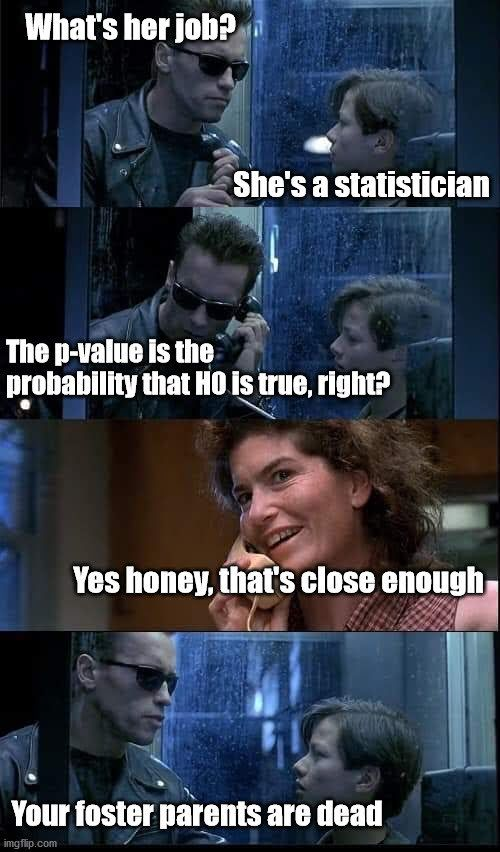

<!-- LTeX: language=en-US -->
# Linear Regression {#sec-linearRegCh}


<!-- 
Points for future Revision: 

* Adding cluster robust SEs

 -->

::: {.hidden}
$$
\require{color}
%% Colorbox within equation-environments:
\newcommand{\highlight}[2][yellow]{\mathchoice%
  {\colorbox{#1}{$\displaystyle#2$}}%
  {\colorbox{#1}{$\displaystyle#2$}}%
  {\colorbox{#1}{$\displaystyle#2$}}%
  }%
$$
:::


<!-- 
This chapter is based on the following references:

* Chapter 3 of [An Introduction to Statistical Learning](https://www.statlearning.com/)
* Chapter 1 of Econometrics by Fumio Hayashi 
-->


## Motivation: Does Education Increase Wages? {#sec-motivation}

How much does one additional year of schooling increase a worker's hourly earnings? This question sits at the heart of labor economics and teaches us a lot about what data can actually tell us. We observe in data that workers with more schooling tend to earn more — but how large is this association, how precisely can we estimate it, and can we say that education *causes* higher wages?

To answer these questions we use the `wage1` dataset from the `wooldridge` R package, which contains data on $n=526$ workers drawn from the 1976 Current Population Survey. @tbl-wage1-summary summarizes the key variables.

```{r}
#| label: tbl-wage1-summary
#| tbl-cap: "Key variables in the `wage1` dataset ($n = 526$ workers, 1976 Current Population Survey)."
library("wooldridge")
library("kableExtra")
data("wage1")

vars <- c("wage", "educ", "exper", "tenure", "female")
desc_tab <- data.frame(
  Variable    = vars, 
  Description = c("Hourly wage (USD)",
                  "Years of education",
                  "Years of work experience",
                  "Years with current employer",
                  "= 1 if female, 0 if male"),
  Mean = round(sapply(vars, \(v) mean(wage1[[v]])), 2),
  SD   = round(sapply(vars, \(v) sd(wage1[[v]])),   2),
  Min  = round(sapply(vars, \(v) min(wage1[[v]])),  2),
  Max  = round(sapply(vars, \(v) max(wage1[[v]])),  2),
  row.names = NULL
)
kbl(desc_tab,
    col.names = c("Variable", "Description", "Mean", "SD", "Min", "Max"),
    align = c("l", "l", "r", "r", "r", "r")) |>
  kable_styling(bootstrap_options = c("striped", "hover"))
```

The scatter plot below shows hourly wages (`wage`) against years of education (`educ`) for all $n=526$ workers. Because education is measured in integer years, we add a small horizontal jitter to avoid overplotting. The plotted line is a preview of what this chapter builds up to: the **fitted simple linear regression** of wages on education.

```{r}
#| label: fig-wage-educ
#| echo: false
#| fig-cap: >
#|   Hourly wages and years of education for $n=526$ workers.
#|   The line is the fitted simple linear regression; the shaded band
#|   is a 95% confidence interval for the regression line.
lm_simple <- lm(wage ~ educ, data = wage1)
x_seq     <- seq(min(wage1$educ), max(wage1$educ), length.out = 200)
ci        <- predict(lm_simple,
                     newdata  = data.frame(educ = x_seq),
                     interval = "confidence")

plot(jitter(wage1$educ, factor = 0.6), wage1$wage,
     xlab = "Education (years)",
     ylab = "Hourly Wage (USD)",
     pch  = 16,
     col  = adjustcolor("steelblue", alpha.f = 0.4),
     las  = 1, 
     ylim = range(wage1$wage, -3))
polygon(c(x_seq, rev(x_seq)),
        c(ci[, "lwr"], rev(ci[, "upr"])),
        col    = adjustcolor("lightcoral", alpha.f = 0.3),
        border = NA)
abline(lm_simple, col = "darkred", lwd = 2)
```

::: {.callout-note collapse="true"}
## R Code: Scatter Plot of Wages and Education with Fitted Line
```{r}
#| ref.label: fig-wage-educ
#| eval: false
```
:::

Two features of @fig-wage-educ will guide the entire chapter. 

* **First**, the positive slope of the fitted line tells us that wages rise with education on average, but by exactly how much, and how sure are we? 
* **Second**, the wide vertical spread of points around the line shows that education alone explains only part of the variation in wages: workers with the same years of schooling earn very different amounts. This raises the question of what else matters — experience, tenure, gender?

::: {.callout-note appearance="simple" icon="false"}
## Guiding Questions

1. **Estimation:** By how much does an additional year of education increase wages, on average?
2. **Inference:** Is this association statistically reliable, or could it reflect chance variation in our sample of $n=526$ workers?
3. **Prediction:** How well can we predict a worker's wage?

We address also a fourth, harder question in @sec-whatdoesbeta: does education *cause* higher wages, or do we merely observe an association?
:::

This chapter develops the statistical tools to answer these questions. We begin with the **simple linear regression model** (wages regressed on education alone) and then extend to the **multiple linear regression model**, which lets us control for further variables such as experience, tenure, and gender simultaneously.


## Simple Linear Regression {#sec-simpleLinReg}

We begin with the simplest version of the linear regression model: a single
predictor $X_i$ explaining variation in an outcome $Y_i$. In the wages
example, $Y_i$ is the hourly wage and $X_i$ is the years of education of
worker $i$.

### The Model {#sec-simpleLR-model}

The **simple linear regression model** is given by

$$
Y_i = \beta_1 + \beta_2 X_i + \varepsilon_i, \quad i = 1, \dots, n,
$${#eq-simpleLR}

where:

* $Y_i$ is the **outcome (or dependent) variable** (hourly wage of worker $i$)
* $X_i$ is the **predictor (or independent) variable** (years of education of worker $i$)
* $\beta_1$ is the **intercept** — the expected wage when $X_i = 0$
* $\beta_2$ is the **slope** — the expected change in wages for one additional
  year of education
* $\varepsilon_i$ is the **"error" term** — capturing all other determinants of
  wages beyond education (ability, family background, occupation, parents, ...)


::: {.callout-note appearance="simple"}
## Crucial Assumption on $\varepsilon_i$: Exogeneity {-}

$$
E(\varepsilon_i \mid X_1, \dots, X_n) = 0, \quad i = 1, \dots, n
$$

That is, the mean of the error $\varepsilon_i$ of worker $i$ is zero
regardless of the education levels $X_1, \dots, X_n$ of *all* workers in
the sample — including worker $i$'s own education $X_i$. This is called
**strict exogeneity**. In particular, it implies that the mean of
$\varepsilon_i$ is zero regardless of the value of $X_i$,
$$
E(\varepsilon_i \mid X_i = x) = 0, \quad i = 1, \dots, n,
$$
for all possible values of $x.$ One often says: 
::: {.center}
"$\varepsilon_i$ must be **mean independent** of $X_i.$" 
:::
The mean independence or exogeneity assumption effectively requires that, conditional on education $X_i=x,$ no other factor drives wages $Y_i$ that is also correlated with education $X_i.$ (Admittedly, this requirement is not readily visible from the above conditional mean statement, but one can show that this requirement is implied by the assumption.) 

**Problem:** Generally, we cannot prove that the exogeneity assumption is true, but need to argue its plausibility using specific expert knowledge about the data problem of interest. 
:::

The **simple linear regression model** @eq-simpleLR specifies the conditional mean of $Y_i$ given $X_i=x$ as a linear function
\begin{align*}
m(x)
& = E(Y_i \mid X_i = x) \\[2ex]
& = E(\beta_1 + \beta_2 X_i + \varepsilon_i \mid X_i = x)  \\[2ex]
& = E(\beta_1 + \beta_2 X_i\mid X_i = x) + \underbrace{E(\varepsilon_i \mid X_i = x)}_{=0}  \\[2ex]
& = \beta_1 + \beta_2 x 
\end{align*}


The slope $\beta_2$ equals the partial derivative of the conditional mean function $m(x)=E(Y_i\mid X_i=x)$ with respect to $X_i=x$:

\begin{align*}
\frac{\partial}{\partial x} m(x) 
& = \frac{\partial}{\partial x} E(Y_i \mid X_i = x) \\[2ex]
& = \frac{\partial}{\partial x} \left(\beta_1 + \beta_2 x\right) \\[2ex] 
& = \beta_2.
\end{align*}

In words: a one-unit increase in $X_i$ changes the *expected* value of $Y_i$
by $\beta_2$ units. In the wages example, $\beta_2$ measures the expected
wage premium per additional year of schooling, in dollars per hour.

::: {.callout-note appearance="simple"}
The model specifies the *conditional mean* of wages as linear in education.
It does not say every worker with the same education earns the same wage.
The error term $\varepsilon_i$ captures the deviation of worker $i$'s actual
wage from the conditional mean function $E(Y_i \mid X_i=x)=m(x).$
:::

### OLS Estimation {#sec-OLS-simple}

The parameters $\beta_1$ and $\beta_2$ are unknown. The **Ordinary Least
Squares (OLS)** estimator chooses $\widehat\beta_1$ and $\widehat\beta_2$ to minimize
the sum of squared deviations of the observations $Y_i$ from the line
$b_1 + b_2 X_i$:

$$
(\widehat\beta_1,\, \widehat\beta_2)
= \arg\min_{b_1,\,b_2}
  \sum_{i=1}^{n} \bigl(Y_i - b_1 - b_2 X_i\bigr)^2.
$${#eq-OLS-min}

Taking partial derivatives of the sum of squares in @eq-OLS-min with respect to $b_1$ and $b_2$, setting them to zero, and solving yields the closed-form OLS estimators:

$$
\widehat\beta_2
= \frac{\displaystyle\frac{1}{n}\sum_{i=1}^{n}(X_i - \bar X)(Y_i - \bar Y)}
       {\displaystyle\frac{1}{n}\sum_{i=1}^{n}(X_i - \bar X)^2}
= \frac{\widehat{\operatorname{Cov}}(X,\,Y)}{\widehat{\operatorname{Var}}(X)}
$${#eq-OLS-slope}

and

$$
\displaystyle \widehat\beta_1 = \bar Y - \widehat\beta_2\,\bar X,
$${#eq-OLS-intercept}

where 

* $\bar X = \tfrac{1}{n}\sum_{i=1}^n X_i$ 
* $\bar Y = \tfrac{1}{n}\sum_{i=1}^n Y_i$

In R, the `lm()` function computes the OLS estimates:

```{r}
lm_simple <- lm(wage ~ educ, data = wage1)
coef(lm_simple)
```

We can verify @eq-OLS-slope and @eq-OLS-intercept directly:

```{r}
beta2_hat <- cov(wage1$educ, wage1$wage) / var(wage1$educ)
beta1_hat <- mean(wage1$wage) - beta2_hat * mean(wage1$educ)
cbind(beta_by_hand = c(beta1_hat, beta2_hat),
      beta_by_R    = coef(lm_simple))
```

The **fitted value** $\widehat Y_i\colon$
$$
\widehat Y_i = \widehat{m}(X_i) = \widehat\beta_1 + \widehat\beta_2 X_i
$$ 
is the model's prediction of the wage of worker $i$. 

The **residual** $\widehat{\varepsilon}_i\colon$
$$
\widehat{\varepsilon}_i = Y_i - \widehat Y_i
$$ 
is the prediction error.


#### **Interpretation of the Estimated Parameters:** {-}

* The estimated slope parameter 
\begin{align*}
\widehat\beta_2
&=\frac{\partial}{\partial x}\widehat{E}(Y_i|X_i=x)\\[2ex]
&=\frac{\partial}{\partial x}\widehat{m}(Y_i|X_i=x)\\[2ex]
&=\frac{\partial}{\partial x}\big(\widehat{\beta}_1 + \widehat{\beta}_2 x\big)
=\widehat{\beta}_2 = `r round(coef(lm_simple)["educ"], 2)`
\end{align*}
means that on average each additional year of education is associated with an increase of approximately `r round(coef(lm_simple)["educ"], 2)` dollar per hour in wages.
* The estimated intercept parameter
\begin{align*}
\widehat\beta_1
&=\widehat{E}(Y_i|X_i=0)\\[2ex]
&=\widehat{m}(Y_i|X_i=0)\\[2ex]
&=\big(\widehat{\beta}_1 + \widehat{\beta}_2 0\big)
=\widehat{\beta}_1 = `r round(coef(lm_simple)["(Intercept)"], 2)`
\end{align*}
is the predicted wage for a worker with zero years of education. 

::: {.callout-caution appearance="simple"}
## When Is This Interpretation Justified?
The interpretation above treats $\widehat\beta_2$ as a reliable estimate of the true slope $\beta_2$ of the conditional mean function
$m(x) = E(Y_i \mid X_i = x)$. 

This is justified only if **Assumptions 1–3** in @sec-simpleLR-assumptions are fulfilled. Under these assumptions, the OLS estimators are unbiased
(@sec-simpleLR-props). 

If these assumptions are violated, for instance, 

* because of an omitted variable such as ability drives both education and wages (violates strict exogeneity Assumption 2), or 
* because the linear model is misspecified (violates the model Assumption 1), 

then $\widehat\beta_2$ systematically over- or understates the true unknown $\beta_2,$ and the interpretation can be misleading.

The next paragraph shows that there is indeed reason for doubt here.
:::

#### **Checking Model Specification:** {-}

@fig-wage-educ shows the fitted straight line 

<center>
$\widehat\beta_1 + \widehat\beta_2 x = `r sprintf("%.2f", coef(lm_simple)["(Intercept)"])` + `r round(coef(lm_simple)["educ"], 2)` \cdot x$
</center>

</br>

❗Note that the predicted values are **outside** the observed wages $Y_i$ for education values $X_i=$`educ`$_i \leq 0.$ 

This means that our simple linear regression model is **misspecified**. 

A well specified model has its regression line in the center of the data cloud for ***all* values** of $X_i.$ 

Below, we will improve the model specification using a log-transformation $\log(Y_i)$; see @sec-logtrans.


### Assumptions {#sec-simpleLR-assumptions}

The OLS estimators $\widehat\beta_1$ and $\widehat\beta_2$ have desirable statistical
properties under four assumptions.

#### **Assumption 1: Linear Model and Random Sampling** {-}

The data $(Y_1, X_1), \dots, (Y_n, X_n)$ are a realization of an **(i.i.d.)
random sample** from the simple linear regression model in @eq-simpleLR
$$
Y_i = \beta_1 + \beta_2 X_i + \varepsilon_i, \quad i = 1, \dots, n.
$$
Random sampling means the $n$ observations are drawn independently from the same (identical) population distribution (i.i.d.).

#### **Assumption 2: Strict Exogeneity** {-}

$$
E(\varepsilon_i \mid X) = 0, \quad i = 1, \dots, n,
\qquad\text{where } X = (X_1, \dots, X_n).
$$

This is the crucial assumption introduced together with the model in
@sec-simpleLR-model. The shorthand $X$ for the predictor values of the
whole sample is also used below, for instance in
$\operatorname{Var}(\widehat\beta_2 \mid X)$.

::: {.callout-note appearance="simple"}
## Why Condition on **All** of $X_1, \dots, X_n$?
The OLS estimator $\widehat\beta_2$ in @eq-OLS-slope depends on the
education levels of *all* $n$ workers. To show that it is unbiased, we
therefore need the errors to have mean zero given all of them — not only
given worker $i$'s own $X_i$.

Under random sampling (Assumption 1), worker $i$'s data $(Y_i, X_i)$ are
independent of the other workers' education levels, so that
$$
E(\varepsilon_i \mid X_1, \dots, X_n) = E(\varepsilon_i \mid X_i).
$$ 
For random samples, strict exogeneity thus reduces to weak exogeneity 
$$
E(\varepsilon_i \mid X_i) = 0\quad\text{for all}\quad i=1,\dots,n.
$$ 
Strict exogeneity becomes a genuinely stronger requirement with time series data, where, e.g., today's shock $\varepsilon_t$ can affect tomorrow's predictor value $X_{t+1}.$
:::

::: {.callout-caution appearance="simple"}
## When Does Exogeneity Fail?

Exogeneity fails, for instance, when an **omitted variable** (a variable we missed including into the regression model), say $W_i,$ is correlated with both 

* $X_i$ the predictor variable and 
* $Y_i$ the outcome variable. 

Let, for instance, denote workers' ability by $W_i.$ This variable is hardly measurable and quantifiable and can thus usually not be considered as further predictor variable in the regression model. However, a workers' ability $W_i$ will usually explain a part of the worker's wage $Y_i$ and is thus part of the error term $\varepsilon_i.$  

If higher-ability workers (large $W_i$) tend to acquire more education (large $X_i$) and vice-versa, i.e. 
$$
\operatorname{Cov}(W_i,X_i)>0,
$$ 
**and** if higher-ability workers (large $W_i$) tend to have higher wages (large $Y_i$) and vice-versa, i.e. 
$$
\operatorname{Cov}(W_i, Y_i)>0,
$$ 
then $X_i$ is not exogenous and, equivalently, $\varepsilon_i$ is not mean-independent of $X_i$,
$$
E(\varepsilon_i \mid X_i) \neq 0.
$$ 
This is the **omitted variable problem**, revisited in @sec-OVB. In such a situation, we cannot trust our estimates. 
:::

#### **Assumption 3: Variation in $X$** {-}

$$
\operatorname{Var}(X_i) > 0\quad\text{for all}\quad i=1,\dots,n.
$$

The predictor variables $X_i$ must have positive variance. If all workers had identical education levels, the denominator in @eq-OLS-slope would be zero and the estimator 
$$
\widehat\beta_2 = \frac{\widehat{\operatorname{Cov}}(X,\,Y)}{\widehat{\operatorname{Var}}(X)}
$$ 
of $\beta_2$ could not be computed.

#### **Assumption 4: Homoskedasticity** {-}

$$
\operatorname{Var}(\varepsilon_i \mid X_i) = \sigma^2
  \quad\text{for all}\quad i=1,\dots,n.
  $$

The variance of the error is constant across all values of $X_i$. 


::: {.callout-caution appearance="simple"}
## Heteroskedasticity
The scatter plot @fig-wage-educ suggests Assumption 4 of homoskedastic errors may be violated: the spread of
wages around the regression line appears wider for more-educated workers.

We address the case of heteroskedasticity below, under **heteroskedasticity-robust standard
errors** in @sec-robustSE-simple.
:::

### Properties of the OLS Estimator {#sec-simpleLR-props}

Under Assumptions 1–3, the OLS estimators are **unbiased**:

$$
E(\widehat\beta_1) = \beta_1 \qquad \text{and} \qquad E(\widehat\beta_2) = \beta_2.
$$

That is, on average over many hypothetical random samples, the OLS estimators recover the true parameter values.

Under Assumptions 1–4, the variance of $\widehat\beta_2$ conditional on
$X=(X_1,\dots,X_n)$ is

$$
\operatorname{Var}(\widehat\beta_2 \mid X)
= \frac{\sigma^2}{\displaystyle\sum_{i=1}^{n}(X_i - \bar X)^2}.
$${#eq-var-beta2}

Three implications stand out:

* **More variation in $X$** (larger denominator) $\Rightarrow$ smaller
  variance $\Rightarrow$ more precise estimate.
* **Larger error variance $\sigma^2$** $\Rightarrow$ larger variance
  $\Rightarrow$ less precise estimate.
* **Larger sample size $n$** $\Rightarrow$ larger denominator
  $\Rightarrow$ more precise estimate.

Since $\sigma^2=\operatorname{Var}(\varepsilon_i)$ is unknown, we replace it in @eq-var-beta2 by 
$$
\widehat\sigma^2 = \frac{1}{n-2}\sum_{i=1}^n\widehat\varepsilon_i^2.
$${#eq-sigma2-hat}
The denominator is $n-2$ rather than $n$ because **two** parameters
($\widehat\beta_1$, $\widehat\beta_2$) have been estimated already from the data; this "degrees of freedom in the data adjustment" makes $\widehat\sigma^2$ an unbiased estimator of $\sigma^2;$ i.e. $E(\widehat\sigma^2)=\sigma^2.$

Plugging $\widehat\sigma^2$ into @eq-var-beta2 yields
the ***estimated* variance of $\widehat\beta_2$**:
$$
\widehat{\operatorname{Var}}(\widehat\beta_2\mid X)
= \frac{\widehat\sigma^2}{\displaystyle\sum_{i=1}^{n}(X_i - \bar X)^2}.
$$
Taking the square root yields the ***estimated* standard error**:
$$
\widehat{\operatorname{SE}}(\widehat\beta_2\mid X)
= \sqrt{\widehat{\operatorname{Var}}(\widehat\beta_2\mid X)}
= \frac{\widehat\sigma}{\sqrt{\displaystyle\sum_{i=1}^{n}(X_i - \bar X)^2}}.
$${#eq-SE-beta2}

We can verify this against the standard error reported by `summary()`:

```{r}
sigma2_hat <- sum(residuals(lm_simple)^2) / (nrow(wage1) - 2)
SE_beta2   <- sqrt(sigma2_hat / sum((wage1$educ - mean(wage1$educ))^2))
c(SE_beta2_by_hand = SE_beta2,
  SE_beta2_by_R    = coef(summary(lm_simple))["educ", "Std. Error"])
```

::: {.callout-note appearance="simple"}
## Gauss–Markov Theorem
Under Assumptions 1–4, the OLS estimators $\widehat{\beta}_2$ and $\widehat{\beta}_1$ in @eq-OLS-slope and @eq-OLS-intercept are the **B**est **L**inear **U**nbiased
**E**stimators (BLUE). That is, among all unbiased estimators of $\beta_1$ and $\beta_2$ that are linear in $Y_1, \dots, Y_n,$ the OLS estimators $\widehat\beta_1$ and $\widehat\beta_2$ have the smallest variance.
:::

### Statistical Inference: $t$-Test for $\beta_2$ {#sec-inference-simple}

Based on the observed wage data, we computed the estimate
$$
\widehat\beta_2 = `r round(coef(lm_simple)["educ"], 2)`.
$$
The true value of $\beta_2$ is unknown; all we have is this estimate. And
the estimate is uncertain: had we observed a different sample of
$n = `r nrow(wage1)`$ workers, we would have obtained a different estimate —
the *sampling variability* discussed in @sec-where-data. 

**Statistical inference** quantifies this uncertainty and tells us which conclusions about the unknown $\beta_2$ are supported by the data.

#### **How Much Would the Estimate Vary Across Samples?** {-}

We cannot easily draw new samples of workers to visualize the variability of the estimates. But we can easily *simulate* 🪄 new samples under a **naive, very likely wrong** setup, just to get a rough idea about the sampling variability. So, let's treat the *estimated* model 
$$
\widehat{m}(x) = \widehat\beta_1 + \widehat\beta_2 \cdot x 
$$
as if it were the true model and let's assume that the error term $\varepsilon_i$ is normally distributed with variance $\widehat\sigma^2$, the *estimated* variance. 


Using this **naive, very likely wrong** data-generating process (see @sec-dgp), we can simply generate many artificial wage data sets, and re-estimate $\beta_2$ on each of them, just to get an idea about how much $\widehat{\beta}_2$ varies across resamplings. 

To see what the estimation results for $\beta_2$ would look like if education had no effect on wages, we repeat the simulation with
$\beta_2 = 0;$ i.e., we repeat it under the null hypothesis 
$$
H_0\colon \beta_2 = 0.
$$

```{r}
#| label: fig-sampling-beta2
#| echo: false
#| fig-cap: >
#|   Estimates of $\beta_2$ from 1000 simulated wage data sets. Left: the
#|   true slope equals the estimate from our data. Right: the true slope is
#|   zero (dashed grey line). The dark red line marks the estimate from our
#|   observed data.
set.seed(123)
n_sim      <- 1000
n          <- nrow(wage1)
beta1_hat  <- coef(lm_simple)[1]
beta2_hat  <- coef(lm_simple)[2]
sigma_hat  <- sqrt(sum(residuals(lm_simple)^2) / (n - 2))

## Simulate new wages and re-estimate beta_2 (education values kept fixed)
## assuming true beta_2 = 0.54
beta2_hat_sim <- numeric(n_sim)
for(k in 1:n_sim){
  
  model_sim  <- beta1_hat + beta2_hat * wage1$educ
  error_sim  <- rnorm(n, sd = sigma_hat)
  ## Simulate outcome values under beta_2 = 0.54
  Y_wage_sim <- model_sim + error_sim
 
  ## Save estimates for beta_2
  beta2_hat_sim[k] <- coef(lm(Y_wage_sim ~ wage1$educ))[2] 
}

## Simulate new wages and re-estimate beta_2 (education values kept fixed)
## under H0: beta_2 = 0 

beta2_hat_H0_sim <- numeric(n_sim)
for(k in 1:n_sim){
  
  model_H0_sim  <- beta1_hat + 0 * wage1$educ
  error_sim     <- rnorm(n, sd = sigma_hat)
  ## Simulate outcome values under beta_2 = 0
  Y_wage_H0_sim <- model_H0_sim + error_sim
 
  ## Save estimates for beta_2
  beta2_hat_H0_sim[k] <- coef(lm(Y_wage_H0_sim ~ wage1$educ))[2] 
}

## Plotting 
bins <- seq(-0.3, 0.8, by = 0.02) # same bins and axis in both panels
x_lim <- c(-0.2, 0.75)
par(mfrow = c(1, 2))
hist(beta2_hat_sim, breaks = bins, 
     col  = "steelblue", 
     border = "white", las = 1,
     xlim = x_lim, ylim = c(0, 160),
     main = expression("Assuming " * beta[2] == 0.54),
     xlab = expression("Simulated estimates of " * beta[2]))
abline(v = beta2_hat, col = "darkred", lwd = 2)
hist(beta2_hat_H0_sim, breaks = bins, 
     col = "steelblue", 
     border = "white", las = 1,
     xlim = x_lim, ylim = c(0, 160),
     main = expression("Assuming " * beta[2] == 0),
     xlab = expression("Simulated estimates of " * beta[2]))
abline(v = 0,         col = "grey40",  lwd = 2, lty = 2)
abline(v = beta2_hat, col = "darkred", lwd = 2)
par(mfrow = c(1, 1))
```

::: {.callout-note collapse="true"}
## R Code: Simulating the Estimates $\widehat{\beta}_2$ of $\beta_2$ (@fig-sampling-beta2)
```{r}
#| ref.label: fig-sampling-beta2
#| eval: false
```
:::

The left panel of @fig-sampling-beta2 shows that the estimates vary around the assumed-to-be-true value $\beta_2 = `r round(beta2_hat, 2)`.$

The right panel of @fig-sampling-beta2 shows the estimates in the hypothetical scenario in which we assume that $\beta_2 = 0$: they vary around zero.


In empirical work, we often want to check whether some variable (e.g., education) has an effect on the outcome (e.g., wages) at all. To check such a **no-effect hypothesis**, we formulate the null hypothesis
$$
H_0\colon \beta_2 = 0
$$
and then try to prove it wrong. That is, we try to reject $H_0,$ based on the evidence in the data. 

The right panel of @fig-sampling-beta2 shows that, under the hypothetical no-effect scenario 
$$
H_0\colon \beta_2 = 0,
$$ 
none of the simulated estimates of $\beta_2$ comes even close to the estimate $\widehat\beta_2 = `r round(beta2_hat, 2)`$ that we computed from the actually observed data (dark red line). 

Our estimate $\widehat\beta_2 = `r round(beta2_hat, 2)`$ thus seems incompatible with the no-effect scenario $$
H_0\colon \beta_2 = 0.
$$ 

However, this argument is merely based on a naive simulation. Statistical hypothesis tests, such as the $t$-test, allow us to do exactly this, but in a scientifically clean and rigorous way.

#### **The $t$-Test** {-}

We test the **null hypothesis** $H_0$ against the two-sided **alternative hypothesis** $H_1$,
\begin{align*}
&H_0\colon \beta_2 = 0\quad\text{(education is unrelated to wages)}\\[2ex]
\text{vs.}\quad &H_1\colon \beta_2 \neq 0\quad\text{(education is related to wages)}
\end{align*}
using the **$t$-statistic**

$$
T = \frac{\widehat\beta_2 - 0}{\widehat{\operatorname{SE}}(\widehat\beta_2 \mid X)}
$${#eq-t-stat}

The $t$-statistic measures how far the estimate lies from zero *in units of standard errors*. Like the estimator $\widehat\beta_2$, the $t$-statistic $T$ is a **random variable:** its value changes from sample to sample. 

We know the *exact* distribution of the random $t$-statistic $T$ if 

* $H_0\colon \beta_2 = 0$ is true (we say "under $H_0\colon \beta_2 = 0$"),
* Assumptions 1–4 hold, and
* the error terms $\varepsilon_i$ are actually normally distributed, $\varepsilon_i \mid X \sim \mathcal{N}(0, \sigma^2)$.

Under these conditions, we have that 
$$
T = \frac{\widehat\beta_2 - 0}{\widehat{\operatorname{SE}}(\widehat\beta_2 \mid X)} \overset{H_0}{\sim} t_{n-2}.
$${#eq-t-dist}

::: {.callout-note appearance="simple"}
## Notation: $\overset{H_0}{\sim}$

We write $\overset{H_0}{\sim}$ (read: "is, under $H_0$, distributed as")
instead of $\sim$ as a reminder: @eq-t-dist holds only if

* $H_0\colon \beta_2 = 0$ is true
* Assumptions 1–4 hold 
* errors $\varepsilon_i$ are normally distributed.
:::


For the **obs**erved value of $T$ computed from our observed data, we write $T_{\operatorname{obs}}.$ Here,
\begin{align*}
T_{\operatorname{obs}}
&= \frac{\widehat{\beta}_{2,\operatorname{obs}} - 0}{\widehat{\operatorname{SE}}(\widehat\beta_2 \mid X)_{\operatorname{obs}}} \\[2ex]
&= \frac{`r sprintf("%.3f", beta2_hat)` - 0}{`r sprintf("%.3f", SE_beta2)`} \\[2ex]
&= `r sprintf("%.1f", beta2_hat / SE_beta2)`
\end{align*}

We can now compare the observed value
$$
T_{\operatorname{obs}} = `r sprintf("%.1f", beta2_hat / SE_beta2)`
$$ 
with the null distribution 
$$
T \overset{H_0}{\sim} t_{n-2},
$$ 
which tells us which values of $T$ we should expect to see if $H_0\colon \beta_2 = 0$ were true. 

Is $T_{\operatorname{obs}}$ compatible with $H_0$, or is it incompatible with $H_0$?

@fig-t-null shows the density of the null distribution together with $T_{\operatorname{obs}}$ (dark red line). 

Under 
$$
H_0\colon \beta_2 = 0,
$$ 
the $t$-statistic typically takes values between about $-2$ and $2$. 

Our observed value 
$$
T_{\operatorname{obs}} = `r sprintf("%.1f", beta2_hat / SE_beta2)`,
$$ 
however, lies far out in the right tail, where the
density is practically zero. 

That is, $T_{\operatorname{obs}}$ is incompatible with $H_0$. (The shaded areas in @fig-t-null are explained below.)

```{r}
#| label: fig-t-null
#| echo: false
#| fig-cap: >
#|   Density of the null distribution $t_{n-2}$ of the $t$-statistic $T$
#|   under $H_0\colon \beta_2 = 0$. The shaded tails are the rejection regions
#|   of the two-sided $t$-test at significance level $\alpha = 0.05$
#|   (dashed grey lines: critical values). The dark red line marks the
#|   observed value $T_{\operatorname{obs}}$.
T_obs  <- beta2_hat / SE_beta2
df_t   <- n - 2
t_crit <- qt(0.975, df = df_t)
t_seq  <- seq(-4, 11, length.out = 1000)

plot(t_seq, dt(t_seq, df = df_t),
     type = "l", lwd = 2, las = 1,
     xlab = "Values of T", ylab = "Density")
## Rejection regions (two-sided, alpha = 0.05)
t_left  <- seq(-4, -t_crit, length.out = 100)
t_right <- seq(t_crit, 11, length.out = 100)
polygon(c(t_left, rev(t_left)), c(dt(t_left, df = df_t), rep(0, 100)),
        col = adjustcolor("lightcoral", alpha.f = 0.6), border = NA)
polygon(c(t_right, rev(t_right)), c(dt(t_right, df = df_t), rep(0, 100)),
        col = adjustcolor("lightcoral", alpha.f = 0.6), border = NA)
abline(v = c(-t_crit, t_crit), lty = 2, col = "grey40")
## Observed value of the t-statistic
abline(v = T_obs, col = "darkred", lwd = 2)
text(T_obs, 0.35, expression(T[obs]), pos = 2, col = "darkred")
```

::: {.callout-note collapse="true"}
## R Code: Plotting the Null Distribution and $T_{\operatorname{obs}}$ (@fig-t-null)
```{r}
#| ref.label: fig-t-null
#| eval: false
```
:::


But how far is far enough? When exactly is the observed estimate $\widehat{\beta}_{2,\operatorname{obs}} = `r sprintf("%.3f", beta2_hat)`$ and its observed value of the $t$-statistic $T_{\operatorname{obs}} = `r sprintf("%.1f", beta2_hat / SE_beta2)`$ incompatible with $H_0\colon\beta_2=0$? 


To answer this question, we use **decision theory**. 


Based on the data, a test makes one of two decisions: 

* reject $H_0$ or 
* fail to reject $H_0.$

Each of the two decisions can be right or wrong, depending on the unknown truth; see @tbl-test-decisions.

|                          | $H_0$ is true                    | $H_0$ is not true                          |
|:-------------------------|:---------------------------------|:-------------------------------------------|
| **Fail to reject $H_0$** | Correct decision  | **Type II error** |
| **Reject $H_0$**         | **Type I error** | Correct decision |

: Possible outcomes of a statistical test. Rows: our decision based on the data. Columns: the unknown truth.  {#tbl-test-decisions}

In empirical work, we usually hope to reject $H_0,$ since a rejection of $H_0$ is what typically gets a scientific paper published. 📄✌️😎

Precisely because we want to reject $H_0$, we must guard against rejecting it wrongly, i.e., against a **Type I error**. We therefore bound the probability of a Type I error from above by a small **significance level** $\alpha$:
$$
\underbrace{P(\text{reject $H_0$} \mid \text{$H_0$ is true})}_{\text{Probability of a Type I error}} \leq \alpha = \text{small value}.
$$

Commonly used significance levels are

* $\alpha = 0.05$
* $\alpha = 0.01$
* $\alpha = 0.001$

We now need a **decision rule** for rejecting $H_0$ such that the probability of a Type I error is bounded from above, for instance by $\alpha=0.05,$
$$
\underbrace{P(\text{reject $H_0$} \mid \text{$H_0$ is true})}_{\text{Probability of a Type I error}} \leq \alpha = 0.05.
$$

**Remember:** Under $H_0$, i.e., under the condition "$\mid$ $H_0$ is true",
we know from @eq-t-dist that
$$
T = \frac{\widehat\beta_2 - 0}{\widehat{\operatorname{SE}}(\widehat\beta_2 \mid X)} \overset{H_0}{\sim} t_{n-2}.
$$
Thus, we can use this knowledge about the null hypothetical distribution to design a **decision rule,** such that the probability of a Type I error is bounded from above by $\alpha = 0.05.$ 


The general idea is the following:

::: {.spaced-list}
1. Assume $H_0\colon \beta_2 =0$ were true.
2. Under $H_0,$ we expect to see $(1-\alpha)\cdot 100 \% = 95\%$ of all realizations of $T\overset{H_0}{\sim} t_{n-2}$ within the interval   
\begin{align*}
& \big[t_{n-2,\, \alpha/2},\; t_{n-2,\, 1-\alpha/2}\big]\\[2ex] 
= & \big[t_{n-2,\, 0.025},\; t_{n-2,\, 0.975}\big] \\[2ex]
= & \big[`r sprintf("%.3f", qt(0.025, df = n - 2))`,\; `r sprintf("%.3f", qt(0.975, df = n - 2))`\big]\quad \text{(using $n=`r n`$)}, 
\end{align*}
where $t_{n-2,\, p}$ denotes the $p$-quantile of the $t$-distribution with $n-2$ degrees of freedom. Computable using R by </br>
$t_{n-2,\, p}= $ `qt(p, df = n - 2)`.
3. Compare the actually observed $T_{\operatorname{obs}}=`r sprintf("%.1f", beta2_hat / SE_beta2)`$ against this null hypothetical range. 
\begin{align*}
T_{\operatorname{obs}} \not\in & \big[t_{n-2,\, 0.025}, t_{n-2,\, 0.975}\big] \\[2ex]
`r sprintf("%.1f", beta2_hat / SE_beta2)` \not\in & \big[`r sprintf("%.3f", qt(0.025, df = n - 2))`, `r sprintf("%.3f", qt(0.975, df = n - 2))`\big]\quad \text{(using $n=`r n`$)} 
\end{align*}

   * If $T_{\operatorname{obs}}$ is inside of it, we fail to reject $H_0$.
   * If $T_{\operatorname{obs}}$ is outside of it, we reject $H_0$.
:::


**Summary: Decision Rule**

::: {.spaced-list}
* **Fail to reject $H_0$** ($T_{\operatorname{obs}}$ is compatible with $H_0$) 
   *  if $t_{n-2,\, \alpha/2}\; \leq \;T_{\operatorname{obs}} \;\leq\; t_{n-2,\, 1-\alpha/2}.$
   * Equivalently, if $|T_{\operatorname{obs}}| \;\leq \; t_{n-2,\, 1-\alpha/2}.$

* **Reject $H_0$** ($T_{\operatorname{obs}}$ is incompatible with $H_0$) 
   * if $T_{\operatorname{obs}} \; < \; t_{n-2,\, \alpha/2}\quad\text{or}\quad t_{n-2,\, 1-\alpha/2} \;<\; T_{\operatorname{obs}}.$
   * Equivalently, if $|T_{\operatorname{obs}}| > t_{n-2,\, 1-\alpha/2}.$
:::


**Critical Value:** The quantile  
$$
t_{n-2,\, 1-\alpha/2}
$$ 
is called the **critical value** of the test. 

Since the $t$-distribution is symmetric around zero, we have that
$$
t_{n-2,\, \alpha/2} = -t_{n-2,\, 1-\alpha/2};
$$ 
that is why the decision rule can be written with 
$$
|T_{\operatorname{obs}}|.
$$


**Rejection Region:** All values of $T$ beyond the critical values, i.e., 
$$
|T| > t_{n-2,\, 1-\alpha/2},
$$
form the **rejection region**: if $T_{\operatorname{obs}}$ falls into it, we reject $H_0$.


In @fig-t-null, the critical values are the dashed grey lines and the rejection region is shaded. For $\alpha = 0.05$ and our sample size, the critical value is
$$
t_{n-2,\, 0.975} = t_{`r n - 2`,\, 0.975} = `r sprintf("%.3f", qt(0.975, df = n - 2))`,
$$
computed with `qt(0.975, df = n - 2)`. Since
$$
|T_{\operatorname{obs}}| = `r sprintf("%.1f", abs(beta2_hat / SE_beta2))` > `r sprintf("%.3f", qt(0.975, df = n - 2))`,
$$
$T_{\operatorname{obs}}$ lies (clearly) in the rejection region, and we reject $H_0\colon \beta_2 = 0$ at the significance level $\alpha=0.05.$ 

Try at what significance levels $\alpha,$ we can reject $H_0\colon\beta_2=0$!

One can show that the decision rule
$$ 
|T_{\operatorname{obs}}| > t_{n-2,\, 1-\alpha/2}
$$
keeps the probability of a Type I error exactly at $\alpha$:
$$
\underbrace{P\bigl(|T| > t_{n-2,\, 1-\alpha/2} \mid \text{$H_0$ is true}\bigr)}_{\text{Probability of a Type I error}} = \alpha.
$$

::: {.callout-tip collapse="true"}
## Going Deeper: Proof that the Probability of a Type I Error Equals $\alpha$

Let $F$ denote the distribution function of the $t_{n-2}$-distribution and
write $q = t_{n-2,\, 1-\alpha/2}$ for short. By @eq-t-dist, $T \overset{H_0}{\sim} t_{n-2}$,
so all probabilities below are computed with $F$.

**Step 1: Split the event.** The event $|T| > q$ means that $T > q$ *or*
$T < -q$. These two events cannot occur at the same time, so their
probabilities add up:
\begin{align*}
P\bigl(|T| > q \mid \text{$H_0$ is true}\bigr)
&= P(T > q \mid \text{$H_0$ is true}) \\
&\quad + P(T < -q \mid \text{$H_0$ is true}).
\end{align*}

**Step 2: Express both parts with $F$.** Since the $t$-distribution is
continuous, $P(T = q) = 0$, and thus
\begin{align*}
P(T > q \mid \text{$H_0$ is true}) & = 1 - F(q), \\[2ex]
P(T < -q \mid \text{$H_0$ is true}) & = F(-q).
\end{align*}

**Step 3: Use the symmetry of the $t$-distribution.** The density of the
$t$-distribution is symmetric around zero (see @fig-t-null), so the area to
the left of $-q$ equals the area to the right of $q$:
$$
F(-q) = 1 - F(q).
$$

**Step 4: Use the definition of the quantile.** $q = t_{n-2,\, 1-\alpha/2}$ is
the $(1-\alpha/2)$-quantile of the $t_{n-2}$-distribution, i.e.,
$F(q) = 1 - \alpha/2$.

**Step 5: Put everything together.**
\begin{align*}
P\bigl(|T| > q \mid \text{$H_0$ is true}\bigr)
& = \bigl(1 - F(q)\bigr) + F(-q) \\[2ex]
& = 2\,\bigl(1 - F(q)\bigr) \\[2ex]
& = 2\,\bigl(1 - (1 - \alpha/2)\bigr) \\[2ex]
& = \alpha. \qquad \blacksquare
\end{align*}

In words: each of the two shaded tails in @fig-t-null has probability
$\alpha/2$, so together they have probability $\alpha$. We can check this
in R for $\alpha = 0.05$ and our sample size:

```{r}
alpha  <- 0.05
q      <- qt(1 - alpha / 2, df = n - 2)   # critical value
2 * (1 - pt(q, df = n - 2))               # P(|T| > q) under H0
```

**Note:** The proof relies on @eq-t-dist being exact, i.e., on normally
distributed errors. Without normality, $P(|T| > q \mid \text{$H_0$ is true})$
is only approximately equal to $\alpha$ for largish $n$ (e.g. $n\geq 30$).
:::


#### **The $p$-Value** {-}


The **$p$-value** is the probability that the
$t$-statistic $T$ takes a value that is, in absolute value, at least as large as the observed value $|T_{\operatorname{obs}}|$, given that $H_0$ is true; i.e.,

\begin{align*}
p_{\operatorname{obs}} 
&= P\bigl(|T| \geq |T_{\operatorname{obs}}| \mid \text{$H_0$ is true}\bigr)\\[2ex]
&= P_{H_0}\bigl(|T| \geq |T_{\operatorname{obs}}|\bigr)
\end{align*}

Based on the $p$-value, there is the following decision rule, which is equivalent to the decision rule above: 

* **Fail to reject $H_0$** ($T_{\operatorname{obs}}$ is compatible with $H_0$) if
$$
p_{\operatorname{obs}} \geq \alpha.
$$

* **Reject $H_0$** ($T_{\operatorname{obs}}$ is incompatible with $H_0$) if
$$
p_{\operatorname{obs}} < \alpha,
$$
where $\alpha$ denotes the significance level such as $\alpha = 0.05.$


::: {.callout-caution}
## 📢 The $p$-value is **Not the Probability that the Null Hypothesis is True!

The p-value is calculated assuming the null hypothesis is true. Therefore, it cannot be the probability of that same hypothesis being true.



:::


#### **Testing Other Hypothesized Values** {-}

The $t$-test is not restricted to the no-effect hypothesis $\beta_2 = 0$. To test whether $\beta_2$ equals any other hypothesized value $\beta_2^0$,
\begin{align*}
&H_0\colon \beta_2 = \beta_2^0\\[2ex]
\text{vs.}\quad &H_1\colon \beta_2 \neq \beta_2^0,
\end{align*}
we use the $t$-statistic
$$
T = \frac{\widehat\beta_2 - \beta_2^0}{\widehat{\operatorname{SE}}(\widehat\beta_2 \mid X)} \overset{H_0}{\sim} t_{n-2}
$$
together with the same decision rule as above.

**Example:** Suppose someone claims that one additional year of education raises hourly wages by $50$ cents on average. To check this claim, we test
\begin{align*}
&H_0\colon \beta_2 = 0.5\\[2ex]
\text{vs.}\quad &H_1\colon \beta_2 \neq 0.5.
\end{align*}
The observed value of the $t$-statistic is
$$
T_{\operatorname{obs}} = \frac{`r sprintf("%.4f", beta2_hat)` - 0.5}{`r sprintf("%.4f", SE_beta2)`} = `r sprintf("%.2f", (beta2_hat - 0.5) / SE_beta2)`,
$$
and the corresponding $p$-value is computed as follows. Let $F$ denote the
distribution function of the $t_{n-2}$-distribution, i.e., the distribution
of $T$ under $H_0$. Then
\begin{align*}
p_{\operatorname{obs}}
&= P_{H_0}\bigl(|T| \geq |T_{\operatorname{obs}}|\bigr) \\[2ex]
&= P_{H_0}\bigl(T \leq -|T_{\operatorname{obs}}|\bigr) 
 + P_{H_0}\bigl(T \geq |T_{\operatorname{obs}}|\bigr) \\[2ex]
% &= P\bigl(T \leq -|T_{\operatorname{obs}}|\;\mid \text{$H_0$ is true}\bigr) + P\bigl(T \geq |T_{\operatorname{obs}}|\;\mid \text{$H_0$ is true}\bigr) \\[2ex]
% &= P\bigl(T \leq -|T_{\operatorname{obs}}|\;\mid \text{$H_0$ is true}\bigr) + 1-P\bigl(T < |T_{\operatorname{obs}}|\;\mid \text{$H_0$ is true}\bigr) \\[2ex]
&= F\bigl(-|T_{\operatorname{obs}}|\bigr) + \Bigl(1 - F\bigl(|T_{\operatorname{obs}}|\bigr)\Bigr) \\[2ex]
&= 2\,\Bigl(1 - F\bigl(|T_{\operatorname{obs}}|\bigr)\Bigr) \\[2ex]
&= 2\,\bigl(1 - F(`r sprintf("%.2f", abs(beta2_hat - 0.5) / SE_beta2)`)\bigr) \\[2ex]
&= 2\,\bigl(1 - `r sprintf("%.4f", pt(abs(beta2_hat - 0.5) / SE_beta2, df = n - 2))`\bigr) \\[2ex]
&= `r sprintf("%.2f", 2 * pt(-abs((beta2_hat - 0.5) / SE_beta2), df = n - 2))`.
\end{align*}
Step by step:

1. The event $|T| \geq |T_{\operatorname{obs}}|$ consists of the two non-overlapping events $T \leq -|T_{\operatorname{obs}}|$ (left tail) and $T \geq |T_{\operatorname{obs}}|$ (right tail), so their probabilities add up.
2. We express both tail probabilities with $F$ (the cdf of $t_{n-2}$). (Since the $t$-distribution is continuous, it does not matter whether we write $\geq$ or $>$ and $\leq$ or $<$.)
3. The $t$-distribution is symmetric around zero, so both tails have the same probability: $F(-|T_{\operatorname{obs}}|) = 1 - F(|T_{\operatorname{obs}}|).$
4. We plug in $|T_{\operatorname{obs}}|$ and evaluate $F$ with R's `pt()` function:

```{r}
## observed t-statistic
T_obs_05 <- unname((beta2_hat - 0.5) / SE_beta2)
# F(|T_obs|)
F_value  <- pt(abs(T_obs_05), df = n - 2)
## observed p-value
p_obs    <- 2 * (1 - F_value)

c(T_obs   = T_obs_05,
  F_value = F_value,
  p_obs   = p_obs)
```

Since 
$$
p_{\operatorname{obs}} \geq \alpha = 0.05,
$$ 
$T_{\operatorname{obs}}$ is compatible with 
$$
H_0\colon\beta_2=0.5,
$$ 
and we thus fail to reject $H_0.$ 


::: {.callout-caution}
## 📢 Failing to Reject $H_0$ Does Not Mean $H_0$ Is True!

Failing to reject $H_0$ does ***not*** allow us to conclude that $H_0\colon\beta_2 = 0.5$ is true!

The reason: we cannot guarantee that the probability of a Type II error
(failing to reject $H_0$ when $H_1$ is true) is small. This would require
knowing the distribution of $T$ under $H_1\colon\beta_2 \neq 0.5$ — which
we do not know, since it depends on the unknown true value of $\beta_2$.
:::


#### **Confidence Interval** {-}

A $(1-\alpha)\cdot 100\%$ **confidence interval** for $\beta_2$ is the
**random** interval
$$
\begin{aligned}
\operatorname{CI}_{1-\alpha}
= \Bigl[\,&\widehat\beta_2 - t_{n-2,\,1-\alpha/2}\cdot\widehat{\operatorname{SE}}(\widehat\beta_2 \mid X),\\
&\widehat\beta_2 + t_{n-2,\,1-\alpha/2}\cdot\widehat{\operatorname{SE}}(\widehat\beta_2 \mid X)\,\Bigr].
\end{aligned}
$${#eq-CI-beta2}
Its endpoints are computed from the data, so they vary from sample to sample. 

Under Assumptions 1–4 and normally distributed errors, the **coverage probability** is given by
$$
P\bigl(\beta_2 \in \operatorname{CI}_{1-\alpha}\bigr) = 1 - \alpha;
$$
i.e., across many samples, we expect that $(1-\alpha)\cdot 100\%$ of the realized (observed) confidence intervals **cover** (contain) the true (typically unknown) value $\beta_2.$

The value $1-\alpha$ of the coverage probability 
is called the **confidence level**.

@fig-CI-coverage-anim visualizes this randomness: the observed realizations cover the (usually unknown) true parameter value $\beta_2$ in $95\%$ of the cases. 

In actual real data problems, however, we observe only one realization of the $95\%$ confidence interval and we do *not* know whether it covers the true $\beta_2$ or not.

```{r}
#| label: fig-CI-coverage-anim
#| echo: false
#| fig-cap: >
#|   Sequential realizations of the $95\%$ confidence interval for
#|   $\beta_2$ across 40 simulated samples Green intervals
#|   cover the true (usually unknown) $\beta_2$; red intervals miss it. In real data problems, we observe only one realization of the $95\%$ confidence interval and we do not know whether it covers the true $\beta_2$ or not. 
#| fig.show: animate
#| animation.hook: gifski
#| interval: 0.4
#| fig-height: 6

set.seed(1)
n_ci    <- 40
alpha   <- 0.05
educ    <- wage1$educ
n_obs   <- length(educ)
beta1_h <- coef(lm_simple)[1]
beta2_h <- coef(lm_simple)[2]   # treated as the "true" beta_2 here
sigma_h <- sqrt(sum(residuals(lm_simple)^2) / (n_obs - 2))
t_crit  <- qt(1 - alpha / 2, df = n_obs - 2)

ci_lower <- numeric(n_ci)
ci_upper <- numeric(n_ci)
covers   <- logical(n_ci)

for (k in seq_len(n_ci)) {
  Y_sim       <- beta1_h + beta2_h * educ + rnorm(n_obs, sd = sigma_h)
  lm_sim      <- lm(Y_sim ~ educ)
  b2_sim      <- coef(lm_sim)[2]
  se_sim      <- coef(summary(lm_sim))[2, "Std. Error"]
  ci_lower[k] <- b2_sim - t_crit * se_sim
  ci_upper[k] <- b2_sim + t_crit * se_sim
  covers[k]   <- ci_lower[k] <= beta2_h & beta2_h <= ci_upper[k]
}

for (k in seq_len(n_ci)) {
  plot(NA,
       xlim = range(c(ci_lower, ci_upper)),
       ylim = c(0.5, n_ci + 0.5),
       xlab = expression(beta[2]), ylab = "Simulated sample",
       las  = 1, bty = "n",
       ## main must vary by frame, or knitr's plot-merging collapses
       ## the whole animation into a single static image (since each
       ## frame's drawing commands would otherwise be an exact prefix
       ## of the next frame's)
       main = sprintf("Sample %d of %d  —  coverage so far: %d/%d (%.0f%%)",
                       k, n_ci, sum(covers[seq_len(k)]), k,
                       100 * mean(covers[seq_len(k)]))
      )
  abline(v = beta2_h, col = "black", lty = 2, lwd = 2)
  for (j in seq_len(k)) {
    col_j <- if (covers[j]) "forestgreen" else "tomato"
    segments(ci_lower[j], j, ci_upper[j], j, col = col_j, lwd = 2)
    points((ci_lower[j] + ci_upper[j]) / 2, j, pch = 16, col = col_j)
  }
}
```

For $\alpha = 0.05$ and our data, the **observed** $95\%$ confidence interval is
\begin{align*}
\operatorname{CI}_{0.95,\operatorname{obs}}
&= \Bigl[\,\widehat\beta_{2,\operatorname{obs}} - t_{n-2,\,1-\alpha/2}\cdot\widehat{\operatorname{SE}}(\widehat\beta_2 \mid X)_{\operatorname{obs}},\\
&\qquad\;\widehat\beta_{2,\operatorname{obs}} + t_{n-2,\,1-\alpha/2}\cdot\widehat{\operatorname{SE}}(\widehat\beta_2 \mid X)_{\operatorname{obs}}\,\Bigr]\\[2ex]
&= \bigl[\,`r sprintf("%.4f", beta2_hat)` - `r sprintf("%.3f", qt(0.975, df = n - 2))` \cdot `r sprintf("%.4f", SE_beta2)`,\\[2ex]
&\qquad\; `r sprintf("%.4f", beta2_hat)` + `r sprintf("%.3f", qt(0.975, df = n - 2))` \cdot `r sprintf("%.4f", SE_beta2)`\,\bigr] \\[2ex]
&= \bigl[\,`r sprintf("%.3f", beta2_hat - qt(0.975, df = n - 2) * SE_beta2)`,\;\; `r sprintf("%.3f", beta2_hat + qt(0.975, df = n - 2) * SE_beta2)`\,\bigr].
\end{align*}
Since $t_{n-2,\,0.975} \approx 2$ for large $n$, this is roughly the
estimate plus/minus two standard errors.

::: {.callout-caution}
## What the $95\%$ Refers To
The $95\%$ refers to the *procedure*, i.e., to the *random* confidence interval $\operatorname{CI}_{0.95},$ not to a particular, observed confidence interval. 

Once we
have computed $\operatorname{CI}_{0.95,\operatorname{obs}}$ from our data, it
is a fixed interval: it either contains the true $\beta_2$ or it does not: we just don't know. 

❗ It is therefore **not correct** to say: "$\beta_2$
lies in $\bigl[`r sprintf("%.3f", beta2_hat - qt(0.975, df = n - 2) * SE_beta2)`,\, `r sprintf("%.3f", beta2_hat + qt(0.975, df = n - 2) * SE_beta2)`\bigr]$ with probability $95\%$." 
:::

**Confidence intervals and $t$-tests.** 

Consider the hypotheses
\begin{align*}
&H_0\colon \beta_2 = \beta_2^0\\[2ex]
\text{vs.}\quad &H_1\colon \beta_2 \neq \beta_2^0.
\end{align*}

A value $\beta_2^0$ lies inside the
confidence interval exactly if the $t$-test of $H_0\colon \beta_2 = \beta_2^0$
does *not* reject $H_0$:
\begin{align*}
\beta_2^0 \in \operatorname{CI}_{1-\alpha,\operatorname{obs}}
&\iff \widehat\beta_{2,\operatorname{obs}} - t_{n-2,\,1-\alpha/2}\cdot\widehat{\operatorname{SE}}_{\operatorname{obs}}
\;\leq\; \beta_2^0 \\
&\qquad\;\;\text{and}\;\; \beta_2^0 \;\leq\;
\widehat\beta_{2,\operatorname{obs}} + t_{n-2,\,1-\alpha/2}\cdot\widehat{\operatorname{SE}}_{\operatorname{obs}} \\[2ex]
&\iff \bigl|\widehat\beta_{2,\operatorname{obs}} - \beta_2^0\bigr| \leq t_{n-2,\,1-\alpha/2}\cdot\widehat{\operatorname{SE}}_{\operatorname{obs}} \\[2ex]
&\iff \left|\frac{\widehat\beta_{2,\operatorname{obs}} - \beta_2^0}{\widehat{\operatorname{SE}}_{\operatorname{obs}}}\right| \leq t_{n-2,\,1-\alpha/2} \\[2ex]
&\iff |T_{\operatorname{obs}}| \leq t_{n-2,\,1-\alpha/2},
\end{align*}
where $\widehat{\operatorname{SE}}_{\operatorname{obs}}$ is short for the
observed $\widehat{\operatorname{SE}}(\widehat\beta_2 \mid X)$. 

In other words: the observed confidence interval $\operatorname{CI}_{1-\alpha,\operatorname{obs}}$ collects all hypothesized values $\beta_2^0$ that are
compatible with the data. This gives us a third, equivalent decision rule.

**Decision Rule (based on the confidence interval):** To test
\begin{align*}
&H_0\colon \beta_2 = \beta_2^0\\[2ex]
\text{vs.}\quad &H_1\colon \beta_2 \neq \beta_2^0
\end{align*}
at significance level $\alpha$,

::: {.spaced-list}
* **Fail to reject $H_0$** ($T_{\operatorname{obs}}$ is compatible with $H_0$)
   * if $\beta_2^0 \in \operatorname{CI}_{1-\alpha,\operatorname{obs}}$.
* **Reject $H_0$** ($T_{\operatorname{obs}}$ is incompatible with $H_0$)
   * if $\beta_2^0 \notin \operatorname{CI}_{1-\alpha,\operatorname{obs}}$.
:::

**Example:** With $\operatorname{CI}_{0.95,\operatorname{obs}} = \bigl[`r sprintf("%.3f", beta2_hat - qt(0.975, df = n - 2) * SE_beta2)`,\, `r sprintf("%.3f", beta2_hat + qt(0.975, df = n - 2) * SE_beta2)`\bigr]$,

::: {.spaced-list}
* $H_0\colon \beta_2 = 0$ is rejected, since $0 \notin \operatorname{CI}_{0.95,\operatorname{obs}}$ (as found with $T_{\operatorname{obs}}$ above), and
* $H_0\colon \beta_2 = 0.5$ is not rejected, since $0.5 \in \operatorname{CI}_{0.95,\operatorname{obs}}$ (as found in the 50-cents example above).
:::

A single confidence interval thus answers the test question for *all* hypothesized values $\beta_2^0$ at once.

#### **Inference in R** {-}

The `summary()` output reports $\widehat\beta_j$,
$\widehat{\operatorname{SE}}(\widehat\beta_j \mid X)$, the $t$-statistic, and the
$p$-value for each coefficient. `confint()` returns confidence intervals:

```{r}
summary(lm_simple)
confint(lm_simple, level = 0.95)
```

**Interpretation:** The $t$-statistic on `educ` far exceeds the critical
value and the $p$-value is essentially zero, so we reject
$H_0\colon\beta_2 = 0$ at any conventional significance level. The $95\%$
confidence interval $[`r sprintf("%.3f", confint(lm_simple)["educ", 1])`,\, `r sprintf("%.3f", confint(lm_simple)["educ", 2])`]$ lies entirely above
zero: all values of $\beta_2$ that are compatible with the data are positive.

::: {.callout-caution appearance="simple"}
Statistical significance does not imply practical importance. A small
$p$-value tells us that the data are incompatible with the corresponding null hypotheis; it does not tell
us whether the magnitude $\widehat\beta_2 = `r round(coef(lm_simple)["educ"], 2)`$ is large enough to
matter. Always report and interpret the estimated size of the effect, not just the $p$-value.
:::


### Large Samples {#sec-largeSample-simple}

Two of our assumptions are, strictly speaking, rarely true:

1. **normally distributed errors** and 
2. **homoskedasticity**. 

Both turn out to be dispensable for large samples; we just need a large enough $n$.


#### **Do the Errors Need to Be Normal?** {-}

The $t_{n-2}$ null distribution of the $t$-statistic ( @eq-t-dist) is *exact* only if the errors are normally distributed,
$$
\varepsilon_i \mid X \sim \mathcal{N}(0, \sigma^2).
$$

In practice, however, error terms are hardly ever exactly normally distributed. Hourly wages, for instance, are clearly right-skewed and thus cannot be normally distributed.

Luckily, even without normality, the **Central Limit Theorem** makes the $t$-statistic $T$ approximately $\mathcal{N}(0,1)$ for large $n$
$$
T=\frac{\widehat{\beta_2} - \beta_2^0}{\widehat{SE}(\widehat{\beta}_2\mid X)}\overset{H_0}{\approx }\mathcal{N}(0,1), 
$$
where the distributional approximation $(\approx)$ becomes better the larger the sample size $n.$

Since $t_{n-2} \approx \mathcal{N}(0,1)$ for large $n$ as well, the above discussed 

* $t$-tests
* $p$-values
* confidence intervals

which are based on the $t_{n-2}$-distribution remain approximately valid for large $n,$ even when the error terms are not normally distributed.

With $n = `r nrow(wage1)`$ workers, our sample is large enough for this approximation to work well.


#### **Heteroskedasticity-Robust Standard Errors** {#sec-robustSE-simple -}

The above variance (@eq-var-beta2) and standard error formulas  
\begin{align*}
\operatorname{Var}(\widehat\beta_2 \mid X)
=& \frac{\sigma^2}{\displaystyle\sum_{i=1}^{n}(X_i - \bar X)^2}\\[2ex]
\operatorname{SE}(\widehat\beta_2 \mid X)
=& \sqrt{\operatorname{Var}(\widehat\beta_2 \mid X)}
\end{align*}
and their estimators (see @eq-SE-beta2)
\begin{align*}
\widehat{\operatorname{Var}}(\widehat\beta_2\mid X) 
= & \frac{\widehat\sigma^2}{\displaystyle\sum_{i=1}^{n}(X_i - \bar X)^2}\\[2ex]
\widehat{\operatorname{SE}}(\widehat\beta_2\mid X)
= & \sqrt{\widehat{\operatorname{Var}}(\widehat\beta_2\mid X)}
\end{align*}
rely on Assumption 4 (homoskedasticity).


However, the scatter plot in @fig-wage-educ suggests that this assumption is violated: the spread of wages increases with education.

**Heteroskedasticity.** If the error variance
$$
\operatorname{Var}(\varepsilon_i \mid X_i) = \sigma_i^2
$$ 
differs across workers, the variance of $\widehat\beta_2$ is no longer @eq-var-beta2 but
$$
\operatorname{Var}(\widehat\beta_2 \mid X)
= \frac{\displaystyle\sum_{i=1}^{n}(X_i - \bar X)^2\,\sigma_i^2}
       {\Bigl(\displaystyle\sum_{i=1}^{n}(X_i - \bar X)^2\Bigr)^2}.
$${#eq-var-beta2-robust}

Under **homoskedasticity** all $\sigma_i^2 = \sigma^2$ and the variance formula simplifies back to @eq-var-beta2.

**Estimating the robust variance.** @eq-var-beta2-robust is not directly
computable, since $\sigma_i^2$ is unknown for all $i = 1, \dots, n$.
Replacing each unknown $\sigma_i^2$ by the squared residual
$\widehat\varepsilon_i^2$ gives the so-called **HC0** heteroskedasticity-robust
variance estimator
$$
\widehat{\operatorname{Var}}_{\operatorname{HC0}}(\widehat\beta_2 \mid X)
= \frac{\displaystyle\sum_{i=1}^{n}(X_i - \bar X)^2\,\widehat{\varepsilon}_i^2}
       {\Bigl(\displaystyle\sum_{i=1}^{n}(X_i - \bar X)^2\Bigr)^2}
$$
and the **HC0** heteroskedasticity-robust standard error
$$
\widehat{\operatorname{SE}}_{\operatorname{HC0}}(\widehat\beta_2 \mid X)=\sqrt{\widehat{\operatorname{Var}}_{\operatorname{HC0}}(\widehat\beta_2 \mid X)}.
$$

There are several refinements of this idea. The most commonly used,
**HC3** heteroskedasticity-robust estimator, slightly inflates the squared residuals to correct for
small-sample bias.

According to @Long_Ervin_2000, HC3 has the best
finite-sample performance. 


The R packages `sandwich` and `lmtest` compute robust variance and standard error estimates for us:

```{r}
suppressPackageStartupMessages(library("sandwich"))
suppressPackageStartupMessages(library("lmtest"))

## HC3 heteroskedasticity-robust standard error
coeftest(lm_simple, vcov = vcovHC(lm_simple, type = "HC3"))
```

::: {.callout-note appearance="simple"}
In applied work, **always report HC3 robust standard errors**. The
coefficient estimates $\widehat\beta_1, \widehat\beta_2$ are unchanged;
only standard errors, $t$-statistics, and confidence intervals are
affected. The same idea applies, essentially unchanged, to multiple
regression; see @sec-robustSE.
:::


::: {.callout-caution appearance="simple"}
## Consequences of the Wrong Choice

Using the homoskedastic variance formula @eq-var-beta2 although the errors
are heteroskedastic leads to

* **wrong standard errors**, and thus to
* **wrong $t$-statistics**,
* **wrong $p$-values**, and
* **wrong confidence intervals**

rendering inference unreliable.

Using the heteroskedasticity-robust variance formula @eq-var-beta2-robust
although the errors are homoskedastic is harmless: it still leads to (at
least approximately, for large $n$)

* **valid standard errors**, and thus to
* **valid $t$-statistics**,
* **valid $p$-values**, and
* **valid confidence intervals**.

The price is a **loss of precision:** robust standard errors are estimated
less precisely than the usual ones based on @eq-var-beta2, which matters
mainly in small samples (smallish $n$).
:::


## Multiple Linear Regression {#sec-multipleLinReg}

Education alone leaves much of the variation in wages unexplained:
@fig-wage-educ shows that workers with the same education earn very
different wages. Other factors (work experience, job tenure, gender) clearly matter. Adding them
simultaneously serves two goals: it improves prediction accuracy (see
@sec-model-fit), and, as
we will see, it corrects for bias in the estimate of the education effect.

### Why Simple Regression Is Not Enough: Omitted Variable Bias {#sec-OVB}

Compare the OLS estimate of the education coefficient in two models:

```{r}
lm_educ_exper <- lm(wage ~ educ + exper, data = wage1)
rbind(
  simple   = coef(lm_simple)["educ"],
  multiple = coef(lm_educ_exper)["educ"]
)
```

The coefficient on `educ` changes when we add `exper`. This is not a
coincidence — it is **omitted variable bias (OVB)**.

**The OVB formula.** Suppose the true model contains two predictors:

$$
Y_i = \beta_1 + \beta_2 X_{i2} + \beta_3 X_{i3} + \varepsilon_i,
$${#eq-true-model}

but we estimate the misspecified simple regression model
$$
Y_i = \gamma_1 + \gamma_2 X_{i2} + u_i
$$ 
that omits $X_{i3}.$ 
Conditional on the predictor values
$X = (X_{12}, \dots, X_{n2},\; X_{13}, \dots, X_{n3})$, and assuming strict
exogeneity in @eq-true-model, i.e., $E(\varepsilon_i \mid X) = 0$, the OLS
estimator $\widehat\gamma_2$ of this short regression satisfies

$$
E(\widehat\gamma_2 \mid X) = \beta_2 + \underbrace{\beta_3 \cdot \widehat\delta}_{\text{bias}},
$${#eq-OVB}

where $\widehat\delta$ is the OLS slope from regressing the omitted
predictor $X_{i3}$ on the included predictor $X_{i2}$. Just like
@eq-OLS-slope, it is the sample covariance of the two predictors divided
by the sample variance of $X_{i2}$:
$$
\widehat\delta
= \frac{\displaystyle\frac{1}{n}\sum_{i=1}^{n}(X_{i2} - \bar X_2)(X_{i3} - \bar X_3)}
       {\displaystyle\frac{1}{n}\sum_{i=1}^{n}(X_{i2} - \bar X_2)^2}
= \frac{\widehat{\operatorname{Cov}}(X_2,\,X_3)}{\widehat{\operatorname{Var}}(X_2)},
$${#eq-OVB-delta}
with the sample means $\bar X_2 = \tfrac{1}{n}\sum_{i=1}^n X_{i2}$ and
$\bar X_3 = \tfrac{1}{n}\sum_{i=1}^n X_{i3}$.

The bias is non-zero whenever

1. $\beta_3 \neq 0$: the omitted variable affects $Y$, and
2. $\widehat\delta \neq 0$, i.e., $\widehat{\operatorname{Cov}}(X_2,\,X_3) \neq 0$: the omitted variable is correlated with the included predictor $X_{i2}$ in the sample.

In the wages example, $X_{i2} = \text{educ}_i$ and $X_{i3} = \text{exper}_i$:

* Workers who spent more years in school have fewer years of work experience,
so $\widehat{\operatorname{Cov}}(X_2,\,X_3)<0$ and thus $\widehat\delta < 0$. 
* Moreover, experience raises wages ($\beta_3 > 0$). 

Thus, the bias is negative
$$
\beta_3 \cdot \widehat\delta < 0
$$ 
which means the simple regression
**understates** the return to education. 


In the sample, the analogous relation even holds exactly: the simple-regression slope equals the
multiple-regression slope plus the estimated bias,
$$
\widehat{\gamma}_2 = \widehat{\beta}_2 + \underbrace{\widehat{\beta}_3 \cdot \frac{\widehat{\operatorname{Cov}}(X_2,\,X_3)}{\widehat{\operatorname{Var}}(X_2)}}_{\text{estimated bias } \widehat\beta_3 \cdot \widehat\delta},
$$
where $\widehat\gamma_2$ is the slope of the simple regression, and
$\widehat\beta_2$ and $\widehat\beta_3$ are the OLS estimates from the
multiple regression with both predictors. In our data:
$$
\underbrace{`r sprintf("%.3f", coef(lm_simple)["educ"])`}_{\widehat\gamma_2}
= \underbrace{`r sprintf("%.3f", coef(lm_educ_exper)["educ"])`}_{\widehat\beta_2}
+ \underbrace{`r sprintf("%.3f", coef(lm_educ_exper)["exper"])`}_{\widehat\beta_3}
\cdot \underbrace{(`r sprintf("%.3f", cov(wage1$educ, wage1$exper) / var(wage1$educ))`)}_{\widehat\delta}.
$$

::: {.callout-note collapse="true"}
## R Code to Reproduce the Omitted Variable Bias Decomposition
```{r}
## delta_hat = sample covariance / sample variance (formula above)
delta_hat <- cov(wage1$educ, wage1$exper) / var(wage1$educ)
c(delta_hat_by_hand = delta_hat,
  delta_hat_by_R    = unname(coef(lm(exper ~ educ, data = wage1))["educ"]))

beta3_hat <- coef(lm_educ_exper)["exper"]

c(delta_hat    = unname(delta_hat),
  beta3_hat    = unname(beta3_hat),
  bias         = unname(beta3_hat * delta_hat),
  educ_2_mult  = unname(coef(lm_educ_exper)["educ"]),
  educ_2_mult_p_bias = unname(coef(lm_educ_exper)["educ"] + beta3_hat * delta_hat),
  educ_2_simple = unname(coef(lm_simple)["educ"]))
```
:::

::: {.callout-important appearance="simple"}
## Business Takeaway: Which Variables Are in the Model Matters
The estimated education coefficient moved from
`r sprintf("%.2f", coef(lm_simple)["educ"])` to
`r sprintf("%.2f", coef(lm_educ_exper)["educ"])` just by adding experience.
Whenever someone presents a regression result (a consultant, a colleague, a dashboard, etc) ask: 

"What else could drive both the predictor of interest (e.g. $X_{i2}$) and the outcome $Y_i$, and is it in the model?"
:::

::: {.callout-caution appearance="simple"}
OVB is a **causal** problem, not a mechanical one. Including additional
control variables reduces bias only if those variables are themselves
exogenous. Adding a "bad control", i.e., a variable that is affected by $X_{i2},$ can introduce new bias. We return to this in @sec-whatdoesbeta.
:::

### The Multiple Linear Regression Model {#sec-multipleLR-model}

The **multiple linear regression model** with $K$ parameters (an intercept and $K-1$ predictors) is

$$
Y_i = \beta_1 + \beta_2 X_{i2} + \dots + \beta_K X_{iK} + \varepsilon_i,
  \quad i = 1, \dots, n.
$${#eq-multipleLR}

For instance, the model with education, experience, and tenure has $K = 4$
parameters:

$$
\text{wage}_i = \beta_1 + \beta_2\,\text{educ}_i + \beta_3\,\text{exper}_i
              + \beta_4\,\text{tenure}_i + \varepsilon_i.
$$

The **multiple linear regression model** @eq-multipleLR specifies the
conditional mean of $Y_i$ given $X_{i2} = x_2, \dots, X_{iK} = x_K$ as a
linear function
\begin{align*}
&m(x_2, \dots, x_K)\\[2ex]
& = E(Y_i \mid X_{i2} = x_2, \dots, X_{iK} = x_K) \\[2ex]
& = E(\beta_1 + \beta_2 X_{i2} + \dots + \beta_K X_{iK} + \varepsilon_i \mid X_{i2} = x_2, \dots, X_{iK} = x_K) \\[2ex]
& = \beta_1 + \beta_2 x_2 + \dots + \beta_K x_K
    + \underbrace{E(\varepsilon_i \mid X_{i2} = x_2, \dots, X_{iK} = x_K)}_{=0} \\[2ex]
& = \beta_1 + \beta_2 x_2 + \dots + \beta_K x_K,
\end{align*}
where the error term drops out by (strict) exogeneity; see the assumptions
below.

**Interpretation of $\beta_k$.** Each slope $\beta_k$, $k = 2, \dots, K$,
equals the partial derivative of the conditional mean function
$m(x_2, \dots, x_K)$ with respect to $x_k$:

\begin{align*}
&\frac{\partial}{\partial x_k} m(x_2, \dots, x_K)\\[2ex]
& = \frac{\partial}{\partial x_k} E(Y_i \mid X_{i2} = x_2, \dots, X_{iK} = x_K) \\[2ex]
& = \frac{\partial}{\partial x_k} \left(\beta_1 + \beta_2 x_2 + \dots + \beta_k x_k + \dots + \beta_K x_K\right) \\[2ex]
& = \beta_k.
\end{align*}

In words: a one-unit increase in $X_{ik}$ changes the *expected* value of
$Y_i$ by $\beta_k$ units, *holding all other predictors constant*. That is
why $\beta_k$ is called a **partial effect**. In the wages example with
education, experience, and tenure, $\beta_2$ measures the expected wage
premium per additional year of schooling, in dollars per hour, for workers
with the *same* experience and tenure. 

The OLS estimator $\widehat\beta = (\widehat\beta_1, \dots, \widehat\beta_K)$
has desirable statistical properties under four assumptions.

#### **Assumption 1: Linear Model and Random Sampling** {-}

The data $(Y_1, X_{12}, \dots, X_{1K}), \dots, (Y_n, X_{n2}, \dots, X_{nK})$
are a realization of an **(i.i.d.) random sample** from the multiple linear
regression model @eq-multipleLR.

#### **Assumption 2: Strict Exogeneity** {-}

$$
E(\varepsilon_i \mid X) = 0, \quad i = 1, \dots, n,
$$
where $X=(X_{12},\dots,X_{nK})$ contains all predictor values
$X_{i2}, \dots, X_{iK}$ of all workers $i = 1, \dots, n$. Worker $i$'s
error $\varepsilon_i$ has mean zero regardless of *everyone's* predictor
values — not only worker $i$'s own.

#### **Assumption 3: No Perfect Multicollinearity** {-}

$$
\operatorname{rank}(X) = K.
$$

No predictor may be an exact linear combination of the other predictors
(including the intercept) — otherwise the columns of $X$ are linearly
dependent, $\operatorname{rank}(X) < K$, and the estimator $\widehat\beta$ is
not uniquely defined. For example, we cannot include both a dummy `female`
and a dummy `male` $= 1 - $`female` together with an intercept — the data
could not tell their effects apart.

#### **Assumption 4: Homoskedasticity** {-}

$$
\operatorname{Var}(\varepsilon_i \mid X) = \sigma^2 \quad\text{for all}\quad i = 1, \dots, n.
$$

The variance of the error is constant across all predictor values.

### OLS Estimation {#sec-OLS-multiple}

The **OLS estimator** chooses
$\widehat\beta_1, \dots, \widehat\beta_K$ to minimize the sum of squared deviations

$$
(\widehat\beta_1, \dots, \widehat\beta_K)
= \arg\min_{b_1, \dots, b_K}
  \sum_{i=1}^{n} \bigl(Y_i - b_1 - b_2 X_{i2} - \dots - b_K X_{iK}\bigr)^2.
$${#eq-OLS-multiple}

With several predictors, there is no longer a short formula like
@eq-OLS-slope that one would compute by hand. `lm()` solves the
minimization problem for us:

```{r}
lm_multiple <- lm(wage ~ educ + exper + tenure, data = wage1)
coef(lm_multiple)
```

**Interpretation:** Controlling for experience and tenure, each additional
year of education is associated with approximately
`r round(coef(lm_multiple)["educ"], 2)` dollars/hour higher wages.

::: {.callout-important appearance="simple"}
## Business Takeaway: Reading a Coefficient
"Controlling for experience and tenure" means *comparing workers who are
alike in these respects*. An HR analyst can report: "Among employees with
the same experience and tenure, those with one more year of education earn
on average \$`r sprintf("%.2f", coef(lm_multiple)["educ"])` more per hour."


❗ The coefficient does *not* say that paying for an employee's extra year of schooling will raise their wage by this amount — that is a causal claim, which we examine in @sec-whatdoesbeta.
:::

::: {.callout-tip collapse="true"}
## Going Deeper: OLS in Matrix Form

This box requires matrix algebra; see @sec-matrixAlgebra for a refresher.

Set $X_{i1} = 1$ for the intercept and stack all $n$ observations:

$$
\underset{(n\times 1)}{Y}
= \underset{(n\times K)}{X}\;
  \underset{(K\times 1)}{\beta}
+ \underset{(n\times 1)}{\varepsilon},
$$
$$
Y = \begin{pmatrix}Y_1\\\vdots\\Y_n\end{pmatrix},\;
X = \begin{pmatrix}
  1 & X_{12} & \cdots & X_{1K}\\
  \vdots & \vdots & \ddots & \vdots\\
  1 & X_{n2} & \cdots & X_{nK}
\end{pmatrix},\;
\beta = \begin{pmatrix}\beta_1\\\vdots\\\beta_K\end{pmatrix}.
$$

The sum of squares in @eq-OLS-multiple becomes 
$$
\widehat\beta = \begin{pmatrix}
\widehat\beta_1\\\vdots\\\widehat\beta_K
\end{pmatrix}
= \arg\min_{b\in\mathbb{R}^K}(Y - Xb)^\top(Y - Xb).
$$ 

Setting its
gradient to zero gives the **normal equations** 
$$
X^\top X\,\widehat\beta = X^\top Y.
$$
No perfect multicollinearity means 
$$
\operatorname{rank}(X) = K,
$$ 
so the $(K\times K)$-matrix 
$$
X^\top X
$$ 
is invertible and
$$
\widehat\beta = (X^\top X)^{-1} X^\top Y.
$${#eq-OLS-matrix}

The fitted values are 
$$
\widehat Y = X\widehat\beta = HY
$$ 
with the $(n \times n)$
**projection matrix** (hat matrix) 
$$
H = X(X^\top X)^{-1}X^\top.
$$ 
Its diagonal elements $h_{ii}$ are **leverage statistics**: a large $h_{ii}$ means observation $i$ has unusual predictor values and thus a potentially large influence on $\widehat\beta.$

We can verify @eq-OLS-matrix in R:

```{r}
X        <- model.matrix(lm_multiple)
Y        <- wage1$wage
beta_hat <- solve(t(X) %*% X) %*% t(X) %*% Y
round(cbind(beta_by_hand = beta_hat, 
            beta_by_R    = coef(lm_multiple)), 4)
```

Under Assumptions 1–4, $\operatorname{Var}(\widehat\beta \mid X) = \sigma^2 (X^\top X)^{-1}$;
the standard errors reported by `summary()` are the square roots of the
diagonal elements of 
$$
\widehat\sigma^2 (X^\top X)^{-1}.
$$

::: {.callout-note collapse="true"}
## Proof: $\operatorname{Var}(\widehat\beta \mid X) = \sigma^2 (X^\top X)^{-1}$

**Step 1: Write $\widehat\beta$ in terms of the errors.** By the rank
condition, $X^\top X$ is invertible. Plugging the model
$Y = X\beta + \varepsilon$ (Assumption 1) into @eq-OLS-matrix gives
\begin{align*}
\widehat\beta
& = (X^\top X)^{-1} X^\top (X\beta + \varepsilon) \\[2ex]
& = \underbrace{(X^\top X)^{-1} X^\top X}_{= I_K}\,\beta + (X^\top X)^{-1} X^\top \varepsilon \\[2ex]
& = \beta + (X^\top X)^{-1} X^\top \varepsilon.
\end{align*}

**Step 2: The conditional mean.** Given $X$, the matrix
$(X^\top X)^{-1} X^\top$ is fixed, so by strict exogeneity
(Assumption 2), $E(\varepsilon \mid X) = 0$,
$$
E(\widehat\beta \mid X) = \beta + (X^\top X)^{-1} X^\top E(\varepsilon \mid X) = \beta.
$$
(This also proves that the OLS estimators are unbiased.)

**Step 3: The conditional variance.** By definition and Steps 1–2,
\begin{align*}
\operatorname{Var}(\widehat\beta \mid X)
& = E\bigl[(\widehat\beta - \beta)(\widehat\beta - \beta)^\top \mid X\bigr] \\[2ex]
& = E\bigl[(X^\top X)^{-1} X^\top \varepsilon\,\varepsilon^\top X (X^\top X)^{-1} \mid X\bigr] \\[2ex]
& = (X^\top X)^{-1} X^\top \, E(\varepsilon\,\varepsilon^\top \mid X) \, X (X^\top X)^{-1}.
\end{align*}
In the second line we used $\bigl((X^\top X)^{-1} X^\top \varepsilon\bigr)^\top = \varepsilon^\top X (X^\top X)^{-1}$, since $X^\top X$ is symmetric.

**Step 4: The $(n \times n)$ matrix $E(\varepsilon\,\varepsilon^\top \mid X)$.**
Its elements are $E(\varepsilon_i \varepsilon_j \mid X)$.

* *Diagonal* ($i = j$): since $E(\varepsilon_i \mid X) = 0$,
  $E(\varepsilon_i^2 \mid X) = \operatorname{Var}(\varepsilon_i \mid X) = \sigma^2$
  by homoskedasticity (Assumption 4).
* *Off-diagonal* ($i \neq j$): under random sampling (Assumption 1),
  worker $i$'s data are independent of worker $j$'s data, so
  $E(\varepsilon_i \varepsilon_j \mid X) = E(\varepsilon_i \mid X)\, E(\varepsilon_j \mid X) = 0 \cdot 0 = 0$.

Hence 
$$
E(\varepsilon\,\varepsilon^\top \mid X) = \sigma^2 I_n.
$$

**Step 5: Put everything together.** Plugging Step 4 into Step 3,
\begin{align*}
\operatorname{Var}(\widehat\beta \mid X)
& = (X^\top X)^{-1} X^\top \, \sigma^2 I_n \, X (X^\top X)^{-1} \\[2ex]
& = \sigma^2 \, \underbrace{(X^\top X)^{-1} X^\top X}_{= I_K} \, (X^\top X)^{-1} \\[2ex]
& = \sigma^2 (X^\top X)^{-1}. \qquad \blacksquare
\end{align*}
:::
:::

### Properties and Robust Standard Errors {#sec-robustSE}

**Unbiasedness.** Under Assumptions 1–3, the OLS estimators are unbiased:
$E(\widehat\beta_k) = \beta_k$ for every $k = 1, \dots, K$.

**Standard errors.** Under Assumptions 1–4, the variance-covariance matrix
of $\widehat\beta$ is $\sigma^2 (X^\top X)^{-1}$ (see the box above). The
standard errors reported by `summary()` are the square roots of its
diagonal elements, with the error variance estimated by
$\widehat\sigma^2 = \frac{1}{n-K}\sum_{i=1}^n\widehat\varepsilon_i^2$. These
standard errors crucially rely on Assumption 4 (homoskedasticity). The
scatter plot in @fig-wage-educ suggests that this assumption is violated:
the spread of wages increases with education.

**Heteroskedasticity.** If the error variance
$\operatorname{Var}(\varepsilon_i \mid X) = \sigma_i^2$ differs across
workers, the homoskedastic formula $\sigma^2 (X^\top X)^{-1}$ no longer
holds; the true variance takes the more general **sandwich form** given in
the box below.

Using the homoskedastic standard errors although the errors are
heteroskedastic leads to

* **wrong standard errors**, and thus to
* **wrong $t$-statistics**,
* **wrong $p$-values**, and
* **wrong confidence intervals**

rendering inference unreliable.

Using heteroskedasticity-robust standard errors although the errors are
actually homoskedastic is harmless: it still leads to (at least
approximately, for large $n$)

* **valid standard errors**, and thus to
* **valid $t$-statistics**,
* **valid $p$-values**, and
* **valid confidence intervals**.

The price is a **loss of precision:** robust standard errors are estimated
less precisely than the usual ones, which matters mainly in small samples
(smallish $n$).

#### **Heteroskedasticity-Robust Standard Errors** {-}

The sandwich variance (box below) is not directly computable, since the
$\sigma_i^2$ are unknown. Replacing each $\sigma_i^2$ by the squared
residual $\widehat\varepsilon_i^2$ gives the so-called **HC0**
heteroskedasticity-robust variance estimator. There are several
refinements of this idea; the most commonly used, **HC3** heteroskedasticity-robust variance estimator, slightly
inflates the squared residuals to improve the small-samples behavior of the variance estimator.


According to @Long_Ervin_2000, HC3 has the best finite-sample performance. The R packages `sandwich` and `lmtest` compute it for us:

```{r}
suppressPackageStartupMessages(library("sandwich"))
suppressPackageStartupMessages(library("lmtest"))

## HC3 heteroskedasticity-robust standard error
coeftest(lm_multiple, 
         vcov = vcovHC(lm_multiple, type = "HC3"))
```

::: {.callout-note appearance="simple"}
In applied work, **always report HC3 robust standard errors**. The coefficient estimates $\widehat\beta_k$ are unchanged; only standard errors,
$t$-statistics, and confidence intervals are affected.
:::

::: {.callout-tip collapse="true"}
## Going Deeper: The Sandwich Formula

This box requires matrix algebra; see @sec-matrixAlgebra.

In matrix notation (see the box in @sec-OLS-multiple), the variance of
$\widehat\beta$ under heteroskedasticity has the **sandwich** form

$$
\operatorname{Var}(\widehat\beta \mid X)
= (X^\top X)^{-1}
  \Bigl(\sum_{i=1}^n \sigma_i^2\, X_i X_i^\top\Bigr)
  (X^\top X)^{-1},
$${#eq-sandwich}

where $X_i = (1, X_{i2}, \dots, X_{iK})^\top$.

* Under homoskedasticity it
simplifies to $\sigma^2 (X^\top X)^{-1}$.
* The **HC0** estimator replaces each unknown $\sigma_i^2$ by the squared
  residual $\widehat\varepsilon_i^2$.
* The **HC3** estimator instead replaces $\sigma_i^2$ by
$\widehat{\varepsilon}_i^2/(1-h_{ii})^2$, where $h_{ii}$ is
the leverage of observation $i$ — a small-sample correction that inflates
the residuals of high-leverage observations.

<!-- 
High-leverage observations tend to have
small residuals because they pull the fitted line toward themselves; the
factor $1/(1-h_{ii})^2$ corrects for this. 
-->
:::

### Statistical Inference {#sec-multipleLR-inference}

#### **$t$-Tests for Individual Coefficients** {-}

Each coefficient $\beta_k$, $k = 1, \dots, K$, can be tested individually.
To test
\begin{align*}
&H_0\colon \beta_k = 0\\[2ex]
\text{vs.}\quad &H_1\colon \beta_k \neq 0,
\end{align*}
we use the $t$-statistic
$$
T_k = \frac{\widehat\beta_k - 0}{\widehat{\operatorname{SE}}(\widehat\beta_k \mid X)}
    \overset{H_0}{\sim} t_{n-K}
$${#eq-t-multiple}
under $H_0$, Assumptions 1–4, and normally distributed errors. The
$t$-distribution has $n - K$ degrees of freedom: we lose one for each of
the $K$ estimated parameters, including the intercept. Without normality,
this distribution holds only approximately, for large $n$ (**Central
Limit Theorem**).

We reject $H_0$ at level $\alpha$ when $T_k$ is incompatible with the null
hypothetical $t_{n-K}$-distribution, i.e., when $T_k$ falls outside the
**critical values** $\pm t_{n-K,\,1-\alpha/2}$:
$$
|T_k| > t_{n-K,\,1-\alpha/2}.
$$

::: {.callout-note appearance="simple"}
## $t$-Tests with Robust Standard Errors
If we use the recommended heteroskedasticity-robust HC3 standard errors 
$$
T_k = \frac{\widehat\beta_k - 0}{\widehat{\operatorname{SE}}_{\operatorname{HC3}}(\widehat\beta_k \mid X)}
$$
the $t_{n-K}$-distribution is no longer
exact, even under normal errors. It remains, however, a valid distributional approximation for large
$n$, due to the Central Limit Theorem.
:::

**Example:** In the model with education, experience, and tenure $(K = 4)$,
we test
\begin{align*}
&H_0\colon \beta_3 = 0\quad \text{(no partial effect of experience)}\\[2ex]
\text{vs.}\quad &H_1\colon \beta_3 \neq 0
\end{align*}
using HC3 standard errors. We construct the observed value of the
$t$-statistic step by step:

1. **Estimate the coefficient.** The OLS estimate of $\beta_3$ is
$$
\widehat\beta_{3,\operatorname{obs}} = `r sprintf("%.4f", coef(lm_multiple)["exper"])`.
$$
2. **Estimate its standard error.** The HC3 standard error is the square
   root of the corresponding diagonal element of the HC3 variance matrix
   (see @sec-robustSE):
$$
\widehat{\operatorname{SE}}_{\operatorname{HC3}}(\widehat\beta_3 \mid X)_{\operatorname{obs}} = `r sprintf("%.4f", sqrt(diag(vcovHC(lm_multiple, type = "HC3")))["exper"])`.
$$

3. **Compute the observed $t$-statistic.**
\begin{align*}
T_{3,\operatorname{obs}}
&= \frac{\widehat\beta_{3,\operatorname{obs}} - 0}{\widehat{\operatorname{SE}}_{\operatorname{HC3}}(\widehat\beta_3 \mid X)_{\operatorname{obs}}} \\[2ex]
&= \frac{`r sprintf("%.4f", coef(lm_multiple)["exper"])` - 0}{`r sprintf("%.4f", sqrt(diag(vcovHC(lm_multiple, type = "HC3")))["exper"])`} \\[2ex]
&= `r sprintf("%.2f", coef(lm_multiple)["exper"] / sqrt(diag(vcovHC(lm_multiple, type = "HC3")))["exper"])`.
\end{align*}
4. **Compare with the critical value.** Since
\begin{align*}
|T_{3,\operatorname{obs}}|
= `r sprintf("%.2f", abs(coef(lm_multiple)["exper"] / sqrt(diag(vcovHC(lm_multiple, type = "HC3")))["exper"]))`
> t_{n-K,\,0.975}
&= t_{`r nobs(lm_multiple) - 4`,\,0.975}\\[2ex]
&= `r sprintf("%.3f", qt(0.975, df = nobs(lm_multiple) - 4))`,
\end{align*}
$T_{3,\operatorname{obs}}$ is incompatible with $H_0$, and we reject
$H_0\colon \beta_3 = 0$ at the $5\%$ level. The same conclusion follows
from the $p$-value,
$$
p_{\operatorname{obs}} = `r sprintf("%.3f", coeftest(lm_multiple, vcov = vcovHC(lm_multiple, type = "HC3"))["exper", 4])` < 0.05.
$$

```{r}
## HC3 variance matrix
V_HC3            <- vcovHC(lm_multiple, type = "HC3")   
## Step 1
beta3_hat_obs    <- coef(lm_multiple)["exper"]           
## Step 2
SE_beta3_HC3_obs <- sqrt(diag(V_HC3))["exper"]      
## Step 3
T3_obs           <- (beta3_hat_obs - 0) / SE_beta3_HC3_obs        

c(beta3_hat_obs    = unname(beta3_hat_obs),
  SE_beta3_HC3_obs = unname(SE_beta3_HC3_obs),
  T3_obs           = unname(T3_obs))

## All in one step (incl. p-value):
coeftest(lm_multiple, vcov = V_HC3)["exper", ]
```

::: {.callout-caution appearance="simple"}
## The Choice of Standard Errors Can Change the Conclusion
With the usual non-robust standard error from `summary()`,
$$
\widehat{\operatorname{SE}}(\widehat\beta_3 \mid X)_{\operatorname{obs}} = `r sprintf("%.4f", coef(summary(lm_multiple))["exper", "Std. Error"])`,
$$
we would get $T_{3,\operatorname{obs}} = `r sprintf("%.2f", coef(summary(lm_multiple))["exper", "t value"])`$
($p_{\operatorname{obs}} = `r sprintf("%.3f", coef(summary(lm_multiple))["exper", "Pr(>|t|)"])`$) and would fail
to reject $H_0.$ 

Here, the HC3 standard error is *smaller* than the usual
one: robust standard errors are not always larger. 

Since the scatter plot
in @fig-wage-educ points to heteroskedasticity, the HC3-based test is the
one to report.
:::


#### **$F$-Test for Joint Significance** {-}

To test whether a *group* of $q$ predictors jointly matters, we use the
**$F$-test**.

**Example: Does the region matter?** The `wage1` data contain three
binary (dummy) variables for the region a worker lives in:

* `northcen` $= 1$ if the worker lives in the north-central U.S., and $= 0$ otherwise,
* `south` $= 1$ if the worker lives in the South, and $= 0$ otherwise, and
* `west` $= 1$ if the worker lives in the West, and $= 0$ otherwise.

For instance, $\text{northcen}_i = 1$ means that worker $i$ lives in the
north-central region, and $\text{northcen}_i = 0$ means that worker $i$ does
*not* live there. Workers in the fourth region, the Northeast, have all three
dummies equal to zero. They serve as the **reference group**: a separate
dummy for the Northeast is left out of the model to avoid perfect
multicollinearity (see @sec-genderGap for more on binary predictors).

We add the three region dummies to the model with education, experience,
and tenure:
$$
\begin{aligned}
Y_i = \beta_1 &+ \beta_2\,\text{educ}_i + \beta_3\,\text{exper}_i + \beta_4\,\text{tenure}_i \\
              &+ \beta_5\,\text{northcen}_i + \beta_6\,\text{south}_i + \beta_7\,\text{west}_i + \varepsilon_i.
\end{aligned}
$$

```{r}
lm_region <- lm(wage ~ educ + exper + tenure + northcen + south + west,
                data = wage1)
## t-tests with HC3 standard errors
coeftest(lm_region,
         vcov = vcovHC(lm_region, type = "HC3"))[c("northcen", "south", "west"), ]
```

None of the three region coefficients is individually significant at the
$5\%$ level: all $p$-values of the individual $t$-tests (with HC3 standard
errors) exceed $0.05$.

Does this mean that the region does not matter? Not necessarily! The question

::: {style="text-align: center;"}
"Does the region matter at all?"
:::

is a ***joint* hypothesis** about all three coefficients:
\begin{align*}
&H_0\colon \beta_5 = \beta_6 = \beta_7 = 0\quad\text{(the region does not matter)}\\[2ex]
\text{vs.}\quad &H_1\colon \text{at least one of } \beta_5, \beta_6, \beta_7 \text{ is } \neq 0,
\end{align*}
with $q = 3$ restrictions (three coefficients set to zero).

The idea of the $F$-test is to compare two models:

* the **unrestricted model** with all $K$ parameters (here: $K = 7$), against 
* the **restricted model**, in which the $q$ coefficients under $H_0$ are set to zero (here: the model without the region dummies).

If $H_0$ is true, dropping the $q$ predictors should increase the sum of squared residuals only a little. The $F$-statistic measures this increase,
relative to the unexplained variation of the unrestricted model:
$$
F = \frac{\frac{1}{q}\Bigl(\sum_{i=1}^{n}\widehat\varepsilon_{i,\text{restr}}^2 - \sum_{i=1}^{n}\widehat\varepsilon_{i}^2\Bigr)}
         {\frac{1}{n-K}\sum_{i=1}^{n}\widehat\varepsilon_i^2}
  \overset{H_0}{\sim} F_{q,\;n-K}
$${#eq-F-stat}
under $H_0$, Assumptions 1–4, and normally distributed errors, where 

* $F_{q,\;n-K}$ denotes the $F$-distribution with $q$ numerator and $n-K$ denominator degrees of freedom (@sec-fdistrib),
* $\widehat\varepsilon_{i,\text{restr}}$ are the residuals of the restricted model, and 
* $\widehat\varepsilon_i$ are the residuals of the unrestricted model. 

Large values of $F$ are incompatible with $H_0$: we reject $H_0$ if
$$
F_{\operatorname{obs}} > F_{q,\,n-K,\,1-\alpha},
$$
where $F_{q,\,n-K,\,1-\alpha}$ denotes the $(1-\alpha)$-quantile of the $F_{q,\,n-K}$-distribution. 

Unlike the $t$-statistic $T$, the $F$-statistic cannot be
negative, so only large values count against $H_0.$

**Robust $F$-test.** Like the usual standard errors, the $F$-statistic in @eq-F-stat assumes homoskedastic errors. Since the wage data are heteroskedastic, we use its heteroskedasticity-robust (HC3) version instead — consistent with the HC3-based $t$-tests above. The robust $F$-statistic
measures the same thing (how strongly the data contradict the $q$
restrictions under $H_0$), but it is computed from the HC3 variance matrix of the estimated coefficients; see the “Going Deeper” box below. 

Under $H_0$, the robust version of the $F$-statistic is approximately $F_{q,\,n-K}$-distributed for large $n$, and the decision rule stays the same.

::: {.callout-tip collapse="true"}
## Going Deeper: The Robust $F$-Statistic

This box requires matrix algebra; see @sec-matrixAlgebra.

Collect the $q$ coefficients under test in the vector $\theta$ (here:
$\theta = (\beta_5, \beta_6, \beta_7)^\top$), so that
$H_0\colon \theta = 0$. Let $\widehat\theta$ be their OLS estimates and
$\widehat V_{\operatorname{HC3}}$ the corresponding $(q \times q)$ block of the
HC3 variance matrix of $\widehat\beta$. The robust $F$-statistic is
$$
F_{\operatorname{HC3}} = \frac{1}{q}\, \widehat\theta^\top \, \widehat V_{\operatorname{HC3}}^{-1} \, \widehat\theta.
$$
For $q = 1$, it reduces to the square of the robust $t$-statistic,
$F_{\operatorname{HC3}} = T_{\operatorname{HC3}}^2$.

```{r}
theta_hat <- coef(lm_region)[c("northcen", "south", "west")]
V_theta   <- vcovHC(lm_region, type = "HC3")[names(theta_hat), names(theta_hat)]
F_by_hand <- drop(t(theta_hat) %*% solve(V_theta) %*% theta_hat) / 3
c(F_by_hand = F_by_hand,
  F_by_R    = waldtest(lm_multiple, lm_region,
                       vcov = vcovHC(lm_region, type = "HC3"))$F[2])
```
:::

In R, `waldtest()` from the `lmtest` package compares the restricted and
the unrestricted model using HC3 standard errors:

```{r}
waldtest(lm_multiple, lm_region, 
         vcov = vcovHC(lm_region, type = "HC3"))
```

**Interpretation:** 

* $F_{\operatorname{obs}} = `r sprintf("%.2f", waldtest(lm_multiple, lm_region, vcov = vcovHC(lm_region, type = "HC3"))$F[2])` > F_{3,\,`r nobs(lm_region) - 7`,\,0.95} = `r sprintf("%.2f", qf(0.95, 3, nobs(lm_region) - 7))`$
* $p$-value: $p_{\operatorname{obs}} = `r sprintf("%.3f", waldtest(lm_multiple, lm_region, vcov = vcovHC(lm_region, type = "HC3"))[["Pr(>F)"]][2])`$)

Thus, we reject $H_0$ at the $5\%$ level: the region matters for wages, even though none of the three region dummies is significant on its own. 

Each individual $t$-test only asks whether *one* region differs from the reference region `northeast`; the $F$-test combines the evidence from all three. Testing predictors one by one can therefore miss what they explain together.

#### **The Default Overall $F$-test** {-} 

The standard $F$-test reported by `summary()` is the
special case that tests ***all* slopes** at once:
\begin{align*}
&H_0\colon \beta_2 = \dots = \beta_K = 0\quad\text{(none of the predictors matters)}\\[2ex]
\text{vs.}\quad &H_1\colon \text{at least one of } \beta_2,\dots,\beta_K \text{ is } \neq 0,
\end{align*}
with $q = K - 1$ restrictions. In this case, the $F$-statistic from
@eq-F-stat simplifies to
$$
F = \frac{\displaystyle\frac{1}{K-1}\sum_{i=1}^{n}(\widehat Y_i - \bar Y)^2}
         {\displaystyle\frac{1}{n-K}\sum_{i=1}^{n}\widehat\varepsilon_i^2}
  \overset{H_0}{\sim} F_{K-1,\;n-K}.
$$

::: {.callout-tip collapse="true"}
## Going Deeper: Derivation of the Overall $F$-Statistic

1. **The restricted model.** Under $H_0$, all slopes are zero, so the
   restricted model contains only the intercept:
$$
Y_i = \beta_1 + \varepsilon_i.
$$
2. **Its OLS estimate and residuals.** The OLS estimate of $\beta_1$ in this
   model is the sample mean, $\widehat\beta_1 = \bar Y$, since $\bar Y$
   minimizes $\sum_{i=1}^n (Y_i - b_1)^2$. The residuals of the restricted
   model are therefore
$$
\widehat\varepsilon_{i,\text{restr}} = Y_i - \bar Y,
\qquad\text{so}\qquad
\sum_{i=1}^{n}\widehat\varepsilon_{i,\text{restr}}^2 = \sum_{i=1}^{n}(Y_i - \bar Y)^2,
$$
   which is the total variation of the outcome.
3. **The numerator.** By the decomposition of the total variation into an
   explained and an unexplained part (see @eq-SS-decomp),
$$
\sum_{i=1}^{n}(Y_i - \bar Y)^2 = \sum_{i=1}^{n}(\widehat Y_i - \bar Y)^2 + \sum_{i=1}^{n}\widehat\varepsilon_i^2,
$$
   the difference of the residual sums of squares in the numerator of
   @eq-F-stat is exactly the variation explained by the unrestricted model:
$$
\sum_{i=1}^{n}\widehat\varepsilon_{i,\text{restr}}^2 - \sum_{i=1}^{n}\widehat\varepsilon_i^2
= \sum_{i=1}^{n}(\widehat Y_i - \bar Y)^2.
$$
4. **The $F$-statistic.** Plugging this into @eq-F-stat with $q = K - 1$
   gives the simplified $F$-statistic above.
:::

In words: the overall $F$-statistic compares the variation **explained** by
the predictors (per restriction) with the variation that remains
**unexplained** (per degree of freedom). If none of the predictors matters,
both parts are of similar size and $F$ is close to $1$; large values of $F$
indicate that the model explains much more than the intercept alone.

`summary()` reports this homoskedasticity-based version. Consistent with the
tests above, we use its robust (HC3) version, which is obtained by calling
`waldtest()` with only one model; the restricted model is then the
intercept-only model:

```{r}
waldtest(lm_region, vcov = vcovHC(lm_region, type = "HC3"))
```

For the region model, $F_{\operatorname{obs}} = `r sprintf("%.1f", waldtest(lm_region, vcov = vcovHC(lm_region, type = "HC3"))$F[2])`$
with a $p$-value that is essentially zero: the predictors jointly matter —
no surprise, given the strong effects of education and tenure.

::: {.callout-note appearance="simple"}
## For Comparison: The Classic $F$-Test
Under homoskedasticity, the classic $F$-test from @eq-F-stat can be computed
with `anova(lm_multiple, lm_region)`. For the region example, it gives
$F_{\operatorname{obs}} = `r sprintf("%.2f", anova(lm_multiple, lm_region)$F[2])`$
($p_{\operatorname{obs}} = `r sprintf("%.3f", anova(lm_multiple, lm_region)[["Pr(>F)"]][2])`$) —
here, the conclusion is the same as with the robust test.
:::

<!-- 
#### **Size, Power, and Consistency** {-}

Recall the two possible errors of a test from @tbl-test-decisions. The
probability of a Type I error is called the **size** of the test; our
decision rules are designed such that the size equals the significance
level $\alpha$. The probability of correctly rejecting a false $H_0$ is
called the **power** of the test:
$$
\text{power} = P(\text{reject $H_0$} \mid \text{$H_1$ is true}) = 1 - P(\text{Type II error}).
$$
Unlike the size, the power is not fixed by us: it depends on the unknown
true value of $\beta_k$.

For the $t$-test of $H_0\colon \beta_k = 0$, the power increases

* with the distance $|\beta_k|$ of the true value from zero,
* with the sample size $n$, and
* with the variation in the predictor $X_{ik}$,

because each of these makes $\widehat\beta_k$ more precise relative to the
distance to be detected (compare @eq-var-beta2).

The reason why larger samples help is **consistency**. Under Assumptions
1–3, the OLS estimators are **consistent**: as $n \to \infty$, the
standard deviation of $\widehat\beta_k$ shrinks to zero, and
$\widehat\beta_k$ converges in probability to the true value,
$\widehat\beta_k \xrightarrow{p} \beta_k$, i.e.,
$P(|\widehat\beta_k - \beta_k| > c) \to 0$ for every $c > 0$. As a
consequence, for any fixed $\beta_k \neq 0$, the power of the $t$-test
tends to $1$ as $n \to \infty$. With small samples, by contrast, even
economically important effects may not be statistically significant. 

-->

### A Binary Predictor: The Gender Wage Gap {#sec-genderGap}

The variable `female` is a **binary (dummy) variable**:
$$
\text{female}_i =
\begin{cases}
1 & \text{if worker $i$ is female},\\
0 & \text{if worker $i$ is male}.
\end{cases}
$$
Adding it to the model with education, experience, and tenure gives

$$
\begin{aligned}
Y_i = \beta_1 &+ \beta_2\,\text{educ}_i + \beta_3\,\text{exper}_i \\
              &+ \beta_4\,\text{tenure}_i + \beta_5\,\text{female}_i + \varepsilon_i.
\end{aligned}
$${#eq-gender-model}

Since $\text{female}_i$ takes only the values $0$ and $1$, the conditional
mean of wages splits into two cases:

* **Men** ($\text{female}_i = 0$):
\begin{align*}
&E(Y_i \mid \text{educ}_i, \text{exper}_i, \text{tenure}_i, \text{female}_i = 0) \\
&\quad= \beta_1 + \beta_2\,\text{educ}_i + \beta_3\,\text{exper}_i + \beta_4\,\text{tenure}_i
\end{align*}
* **Women** ($\text{female}_i = 1$):
\begin{align*}
&E(Y_i \mid \text{educ}_i, \text{exper}_i, \text{tenure}_i, \text{female}_i = 1) \\
&\quad= (\beta_1 + \beta_5) + \beta_2\,\text{educ}_i + \beta_3\,\text{exper}_i + \beta_4\,\text{tenure}_i
\end{align*}

The two conditional means differ only in their intercepts: for fixed
experience and tenure, they are two **parallel lines** in education. Men
are the **reference group** (all-zero dummy), and

$$
\beta_5 = E(Y_i \mid \ldots, \text{female}_i = 1) - E(Y_i \mid \ldots, \text{female}_i = 0)
$$

is the **adjusted wage gap**: the expected wage difference between women
and men with identical education, experience, and tenure. 

As in the region example, we must not add a second dummy `male` $= 1 - \text{female}$:
together with the intercept, this would cause perfect multicollinearity.

```{r}
lm_gender <- lm(wage ~ educ + exper + tenure + female,
                data = wage1)
coeftest(lm_gender, vcov = vcovHC(lm_gender, type = "HC3"))
```

**Interpretation:** $\widehat\beta_5 = `r sprintf("%.2f", coef(lm_gender)["female"])`$: women earn on
average \$`r sprintf("%.2f", -coef(lm_gender)["female"])` per hour less than men with the same education,
experience, and tenure. With HC3 standard errors,
$T_{5,\operatorname{obs}} = `r sprintf("%.2f", coeftest(lm_gender, vcov = vcovHC(lm_gender, type = "HC3"))["female", "t value"])`$ and the $p$-value is
essentially zero, so we can reject the null hypothesis
$$
H_0\colon \beta_5 = 0\quad\text{(no adjusted wage gap)}.
$$

@fig-gender-lines shows the two fitted lines, evaluated at the sample means
of experience and tenure:

```{r}
#| label: fig-gender-lines
#| echo: false
#| fig-cap: >
#|   Fitted wage-education lines for men (blue) and women (red) from
#|   the model in @eq-gender-model, evaluated at mean experience and tenure.
#|   Parallel lines impose identical returns to education for both groups.
beta       <- coef(lm_gender)
exper_bar  <- mean(wage1$exper)
tenure_bar <- mean(wage1$tenure)
educ_seq   <- seq(0, 18, length.out = 200)

wage_men   <- beta["(Intercept)"] +
              beta["educ"]   * educ_seq   +
              beta["exper"]  * exper_bar  +
              beta["tenure"] * tenure_bar
wage_women <- wage_men + beta["female"]

pt_col <- ifelse(wage1$female == 1,
                 adjustcolor("tomato",    alpha.f = 0.35),
                 adjustcolor("steelblue", alpha.f = 0.35))
plot(jitter(wage1$educ, factor = 0.6), wage1$wage,
     col = pt_col, pch = 16,
     xlab = "Education (years)", ylab = "Hourly Wage (USD)",
     las  = 1)
lines(educ_seq, wage_men,   col = "steelblue", lwd = 2)
lines(educ_seq, wage_women, col = "tomato",    lwd = 2)
legend("topleft",
       legend = c("Men", "Women"),
       col    = c("steelblue", "tomato"),
       lwd    = 2, bty = "n")
```

::: {.callout-note collapse="true"}
## R Code: Plotting the Fitted Wage Lines for Men and Women
```{r}
#| ref.label: fig-gender-lines
#| eval: false
```
:::

The model in @eq-gender-model *assumes* equal returns to education for men
and women — the lines are parallel by construction. We relax this
restriction in the next subsection.

::: {.callout-important appearance="simple"}
## Business Takeaway: Raw vs. Adjusted Pay Gap
Pay-equity analyses distinguish two numbers:

* The **raw gap** is the difference in average wages:
  women in the sample earn \$`r sprintf("%.2f", -coef(lm(wage ~ female, data = wage1))["female"])`
  per hour less than men.
* The **adjusted gap** $\widehat\beta_5$ compares women and men with the same
  education, experience, and tenure:
  \$`r sprintf("%.2f", -coef(lm_gender)["female"])` per hour.

About `r round(100 * coef(lm_gender)["female"] / coef(lm(wage ~ female, data = wage1))["female"])`%
of the raw gap remains after accounting for these characteristics. Neither
number settles the question of discrimination on its own: the adjusted gap
may reflect omitted characteristics, and the "explained" part may itself
reflect unequal opportunities — for example, if women were given fewer
chances to build up tenure. Controlling for such variables is the "bad
control" problem from @sec-OVB.
:::


### Interaction Effects: Do Returns to Education Differ by Gender? {#sec-interactions}

To allow different returns to education for men and women, we add the
**interaction term** $\text{educ}_i \times \text{female}_i$ — the product of
the two predictors — to the model in @eq-gender-model:

$$
\begin{aligned}
Y_i = \beta_1 &+ \beta_2\,\text{educ}_i + \beta_3\,\text{exper}_i
               + \beta_4\,\text{tenure}_i \\
              &+ \beta_5\,\text{female}_i
               + \beta_6\,(\text{educ}_i \times \text{female}_i) + \varepsilon_i.
\end{aligned}
$${#eq-interact-model}

The slope on education now differs by gender:

* **Men** ($\text{female}_i = 0$): slope $\beta_2$
* **Women** ($\text{female}_i = 1$): slope $\beta_2 + \beta_6$

So $\beta_6$ is the **difference in the return to education** between women
and men. 

Note that $\beta_5$ alone now measures the gender gap at
$\text{educ}_i = 0$, which is not a meaningful comparison. 

The gap at education level $\text{educ}_i = x$ is given by 
$$
\beta_5 + \beta_6\, x.
$$

```{r}
lm_interact <- lm(wage ~ educ + exper + tenure + female + educ:female,
                  data = wage1)
coeftest(lm_interact, vcov = vcovHC(lm_interact, type = "HC3"))
```

```{r}
#| label: fig-interact-lines
#| echo: false
#| fig-cap: >
#|   Fitted wage-education lines for men (blue) and women (red) from the
#|   interaction model, evaluated at mean experience and tenure.
#|   The lines are no longer forced to be parallel.
b        <- coef(lm_interact)
wage_men <- b["(Intercept)"] +
            b["educ"]   * educ_seq   +
            b["exper"]  * exper_bar  +
            b["tenure"] * tenure_bar
wage_women <- wage_men + b["female"] + b["educ:female"] * educ_seq

plot(jitter(wage1$educ, factor = 0.6), wage1$wage,
     col = pt_col, pch = 16,
     xlab = "Education (years)", ylab = "Hourly Wage (USD)",
     las  = 1)
lines(educ_seq, wage_men,   col = "steelblue", lwd = 2)
lines(educ_seq, wage_women, col = "tomato",    lwd = 2)
legend("topleft",
       legend = c("Men", "Women"),
       col    = c("steelblue", "tomato"),
       lwd    = 2, bty = "n")
```

::: {.callout-note collapse="true"}
## R Code: Plotting the Fitted Lines of the Interaction Model
```{r}
#| ref.label: fig-interact-lines
#| eval: false
```
:::

**Interpretation:** The point estimate
$\widehat\beta_6 = `r sprintf("%.2f", coef(lm_interact)["educ:female"])`$ says that each
additional year of education raises women's hourly wages by about
`r round(-100 * coef(lm_interact)["educ:female"])` cents less than men's. However, the
estimate is imprecise ($p = `r sprintf("%.2f", coeftest(lm_interact, vcov = vcovHC(lm_interact, type = "HC3"))["educ:female", 4])`$
with HC3 standard errors): the data are also consistent with equal returns
to education, i.e., with the parallel lines of @fig-gender-lines.


## Extensions of the Linear Model {#sec-extensions}

The multiple linear regression model @eq-multipleLR is **linear in the
parameters** $\beta_1, \dots, \beta_K$, not necessarily in the original
variables. We can use linear and non-linear transformations such as 

* Transformed outcome: $\log(Y_i)$ 
* New predictor, for instance, 
    * by squaring: $X_{i4} = X_{i3}^2$
    * by interactions: $X_{i6} = \text{educ}_i \times \text{female}_i$ (@sec-interactions)

to generate new outcome and predictor variables. 

Note: The model remains linear in the parameters $\beta_1, \dots, \beta_K,$ so all results from @sec-multipleLinReg continue to apply.

### Log Transformations: The Mincer Equation {#sec-logtrans}

#### **Motivation: The Distribution of Wages** {-}

Hourly wages are right-skewed: a few high earners pull the mean well above
the median. Taking logarithms compresses the right tail and produces a
more symmetric distribution.

```{r}
#| label: fig-wage-hist
#| echo: false
#| fig-cap: >
#|   Distribution of hourly wages (left) and log hourly wages (right)
#|   for 526 workers. Taking logarithms reduces the skewness from
#|   2.0 to 0.4 and brings the distribution closer to symmetry.
par(mfrow = c(1, 2))
hist(wage1$wage,
     breaks = 25, col = "steelblue", border = "white",
     main = "Wage (USD/hour)",
     xlab = "Wage", las = 1)
hist(wage1$lwage,
     breaks = 25, col = "steelblue", border = "white",
     main = "Log Wage",
     xlab = "log(Wage)", las = 1)
par(mfrow = c(1, 1))
```

::: {.callout-note collapse="true"}
## R Code: Histograms of Wages and Log Wages
```{r}
#| ref.label: fig-wage-hist
#| eval: false
```
:::

#### **Interpretation of Log-Level Models** {-}

In a **log-level model**
$$
\log(Y_i) = \beta_1 + \beta_2 X_i + \varepsilon_i,
$$
a one-unit increase in $X_i$ changes the expected *log* of $Y_i$ by
$\beta_2$. Since differences in logs are approximately relative changes,
$$
\log(y_1) - \log(y_0) \approx \frac{y_1 - y_0}{y_0} \quad \text{for small changes,}
$$

* a one-unit increase in $X_i$ is associated with an **approximate** $100 \cdot \beta_2\%$ change in $Y_i$;
<!-- 
* the **exact** change is $100 \cdot (\exp(\beta_2) - 1)\%$, which matters for larger $\beta_2$. 
-->

#### **The Mincer Earnings Equation** {-}

The standard specification in the economics of education is the
**Mincer equation** [@Mincer1974]:

$$
\log(\text{wage}_i)
= \beta_1 + \beta_2\,\text{educ}_i + \beta_3\,\text{exper}_i
+ \beta_4\,\text{exper}_i^2 + \varepsilon_i.
$${#eq-mincer}

Compared to the levels models in @sec-multipleLinReg, this specification:

1. Accommodates the right-skewed wage distribution.
2. Gives $\widehat\beta_2$ a natural interpretation as the **proportional
   return to one year of schooling**.
3. Includes a quadratic in experience to capture diminishing returns to
   experience (see below).

```{r}
lm_mincer <- lm(lwage ~ educ + exper + expersq, data = wage1)
coeftest(lm_mincer, vcov = vcovHC(lm_mincer, type = "HC3"))
```

**Interpretation of $\widehat\beta_2$:** Each additional year of education is
associated with approximately a
`r sprintf("%.1f", 100 * coef(lm_mincer)["educ"])`% increase in hourly wages
(exact: `r round(100 * (exp(coef(lm_mincer)["educ"]) - 1), 1)`%) — a much more
interpretable and economically meaningful number than the
`r round(100 * coef(lm_simple)["educ"])` cents per hour from the simple levels model.

#### **Polynomial Terms: Diminishing Returns to Experience** {-}

Including $\text{exper}_i^2$ turns @eq-mincer into a **polynomial
(quadratic) regression** in experience:

\begin{align*}
%Y_i
%&= \beta_1 + \beta_2\,X_{i2} + \beta_3\,X_{i3}
%+ \beta_4\,\overbrace{X_{i4}}^{\text{new predictor}} + %\varepsilon_i\\[2ex]
\log(\text{wage}_i)
&= \beta_1 + \beta_2\,\text{educ}_i + \beta_3\,\text{exper}_i
+ \beta_4\,\underbrace{\text{exper}_i^2}_{\text{new predictor}} + \varepsilon_i.
\end{align*}

::: {.callout-note appearance="simple"}
The above model is quadratic in $\text{exper}_i$, but still **linear in the parameters** $\beta_1, \dots, \beta_4.$

The squared `exper`-predictor is simply treated as a further (here fourth) predictor 
$$
X_{i4} = \text{exper}_i^2
$$ 
of a multiple linear regression model. 

All OLS theory from @sec-multipleLinReg therefore still applies.
:::

The effect of experience is then no longer constant; the **marginal
effect** of one more year depends on how much experience a worker already
has:

$$
\frac{\partial}{\partial\, \text{exper}} E\bigl(\log(\text{wage}_i) \mid \text{educ}_i, \text{exper}_i\bigr)
= \beta_3 + 2\beta_4\, \text{exper}_i.
$${#eq-marginal-poly}

With $\beta_3 > 0$ and $\beta_4 < 0$, wages rise with experience at a
decreasing rate and peak where the marginal effect is zero, at
$$
\text{exper}^* = -\beta_3/(2\beta_4).
$$

```{r}
#| label: fig-mincer-exper
#| echo: false
#| fig-cap: >
#|   Fitted Mincer wage-experience profile at mean education, back-transformed
#|   to USD/hour (left), and the marginal effect of one additional year of
#|   experience in percent (right).
b          <- coef(lm_mincer)
x_seq      <- seq(0, 50, length.out = 300)
log_fit    <- b["(Intercept)"] + b["educ"] * mean(wage1$educ) +
              b["exper"] * x_seq + b["expersq"] * x_seq^2
me         <- b["exper"] + 2 * b["expersq"] * x_seq
peak_exper <- -b["exper"] / (2 * b["expersq"])

par(mfrow = c(1, 2))
plot(x_seq, exp(log_fit),
     type = "l", col = "darkred", lwd = 2, las = 1,
     xlab = "Experience (years)", ylab = "Predicted Wage (USD/hour)")
abline(v = peak_exper, lty = 2, col = "grey60")
plot(x_seq, 100 * me,
     type = "l", col = "darkred", lwd = 2, las = 1,
     xlab = "Experience (years)", ylab = "Marginal effect (% per year)")
abline(h = 0, lty = 2, col = "grey60")
par(mfrow = c(1, 1))
```

::: {.callout-note collapse="true"}
## R Code: Plotting the Mincer Experience Profile
```{r}
#| ref.label: fig-mincer-exper
#| eval: false
```
:::

**Interpretation:**

* First year of experience: about `r round(100 * b["exper"], 1)`% higher wages.
* A year after 20 years of experience: only about
  `r round(100 * (b["exper"] + 2 * b["expersq"] * 20), 1)`%.
* Wages peak at approximately `r round(peak_exper)` years of experience.

This is consistent with the Mincer literature: wages rise steeply early in
a career and level off later.


## Detecting Potential Problems {#sec-diagnostics}

Before interpreting or reporting a fitted model, we should check whether
the model assumptions are plausible for the data at hand. Three
residual-based diagnostic plots catch the most common violations.

We illustrate using the Mincer equation `lm_mincer` from @sec-logtrans.
The `plot()` method for `lm` objects produces these plots automatically:

```{r}
#| label: fig-diagnostics
#| echo: false
#| fig-cap: >
#|   Residual diagnostic plots for the Mincer equation
#|   log(wage) ~ educ + exper + exper². Panels: (1) residuals vs fitted,
#|   (2) normal Q-Q, (3) scale-location.
par(mfrow = c(1, 3))
plot(lm_mincer, which = 1, sub.caption = "log(wage) model")
plot(lm_mincer, which = 2, sub.caption = "log(wage) model")
plot(lm_mincer, which = 3, sub.caption = "log(wage) model")
par(mfrow = c(1, 1))
```

::: {.callout-note collapse="true"}
## R Code: Residual Diagnostic Plots
```{r}
#| ref.label: fig-diagnostics
#| eval: false
```
:::

#### **Plot 1: Residuals vs. Fitted Values** {-}

```{r}
#| label: fig-diag-resfit
#| echo: false
#| fig-cap: >
#|   Residuals vs. fitted values for the Mincer equation
#|   log(wage) ~ educ + exper + exper².
plot(lm_mincer, which = 1, sub.caption = "log(wage) model")
```

::: {.callout-note collapse="true"}
## R Code: Residuals vs. Fitted Values
```{r}
#| ref.label: fig-diag-resfit
#| eval: false
```
:::

**What to look for:**

* Residuals scatter randomly around zero, no pattern → OK.
* Residuals show a systematic pattern → functional form misspecified (e.g., a missing quadratic term).
* Spread of residuals changes with fitted values →
  **heteroskedasticity**.

**In our model:** No strong pattern. The log transformation and
experience quadratic have captured the main non-linearities. Some spread variation remains → **heteroskedasticity**. Residuals corresponding to small fitted values $\hat{Y}_i$ are strictly above the zero line → **model is possibly misspecified for this part of the data.**

#### **Plot 2: Normal Q-Q** {-}

```{r}
#| label: fig-diag-qq
#| echo: false
#| fig-cap: >
#|   Normal Q-Q plot of the standardized residuals for the Mincer equation
#|   log(wage) ~ educ + exper + exper².
plot(lm_mincer, which = 2, sub.caption = "log(wage) model")
```

::: {.callout-note collapse="true"}
## R Code: Normal Q-Q Plot
```{r}
#| ref.label: fig-diag-qq
#| eval: false
```
:::

**What to look for:** Points should fall close to the 45° line. Clear deviations from the 45° line indicate non-normal errors.

* Normality is **not** needed for the OLS estimators to be unbiased.
* But the $t$- and $F$-distributions in @eq-t-dist and @eq-F-stat are
  exact only if $\varepsilon_i$ is normally distributed.
* For large $n$, the **Central Limit Theorem** ensures approximate
  validity even without normality of $\varepsilon_i.$ Therefore, departures matter most in small samples.
* Exception: the prediction interval in @sec-prediction relies on normality of $\varepsilon_\text{new}$ even in large samples.

**In our model:** The residuals follow the line closely over most of the range. Only the lower tail shows some deviations (e.g., observation 24). With $n = `r nrow(wage1)`$, the Central Limit Theorem provides adequate coverage, and the inference results remain reliable, when based on HC3-robust standard errors.

#### **Plot 3: Scale-Location** {-}

```{r}
#| label: fig-diag-scaleloc
#| echo: false
#| fig-cap: >
#|   Scale-location plot for the Mincer equation
#|   log(wage) ~ educ + exper + exper².
plot(lm_mincer, which = 3, sub.caption = "log(wage) model")
```

::: {.callout-note collapse="true"}
## R Code: Scale-Location Plot
```{r}
#| ref.label: fig-diag-scaleloc
#| eval: false
```
:::

**What to look for:**

* The square root of the absolute standardized residuals should be roughly flat across fitted values. A systematic pattern → **heteroskedasticity**.
* Standardized residuals larger than 2 (in absolute value) → possible
  outliers, which should be investigated (e.g., a typo in the data).

**In our model:** A modest upward trend, i.e., some heteroskedasticity
remains even after the log transformation. This reinforces the
recommendation from @sec-robustSE: **always use HC3 robust standard
errors**. Observation 24 — already noted in Plot 2 — has the largest
standardized residual (in absolute value) in the whole sample and is thus
a possible outlier worth a closer look.

::: {.callout-note appearance="simple"}
Diagnostic plots reveal problems; they do not fix them! 

The appropriate response depends on the violation: 

* heteroskedasticity → robust SEs
* misspecified model → transform predictors or add polynomial terms
* outliers → investigate individual observations
:::


## Prediction vs. Inference {#sec-prediction}

Linear regression serves two distinct purposes, each with its own target
and its own measure of uncertainty:

::: {.spaced-list}
* **Inference on parameters:** *By how much does education raise wages
  on average?*
   * Target: E.g. the population parameter $\beta_2$.
   * Relevant uncertainty: $\widehat{\operatorname{SE}}(\widehat\beta_2 \mid X)$.
* **Prediction:** *What wage would we expect for a specific new worker?*
   * Target: the wage $Y_\text{new}$ of a new worker with predictor
     values $x_{\text{new},2}, \dots, x_{\text{new},K}$.
   * Relevant uncertainty: combines the uncertainties of the estimators $\widehat\beta_1, \dots,\widehat\beta_K$ and the inherent randomness of
     $Y_\text{new}$ around its conditional mean $m(x_\text{new}),$ due to new error term $\varepsilon_\text{new}.$
:::

### Assessing Model Fit: $R^2$ and Adjusted $R^2$ {#sec-model-fit}

Before we quantify the uncertainty of individual predictions, a first question is how well an estimated model predicts all the *observed* outcome values $Y_1,\dots,Y_n$ in our sample.

Recall the **fitted values**
\begin{align*}
\widehat{Y}_i 
& = \widehat{m}(x_i)\\[2ex]
& = \widehat\beta_1 + \widehat\beta_2\, X_{i2} + \dots + \widehat\beta_K\, X_{iK}.
\end{align*}

and **residuals**
$$
\widehat{\varepsilon}_i = Y_i - \widehat{Y}_i,
$$
from @sec-OLS-simple.


We could ask: How well does education alone, i.e., our simple linear regression model in @eq-simpleLR  
$$
Y_i = \beta_1 + \beta_2 \underbrace{X_i}_{=\texttt{educ}_i} + \varepsilon_i, \quad i = 1, \dots, n,
$$
predict the observed wages $Y_1,\dots,Y_n$? 


We measure this through a decomposition of the total variation in $Y_1,\dots,Y_n.$

The total variation in $Y_1,\dots,Y_n$ decomposes into explained and unexplained residual parts:

$$
\underbrace{\sum_{i=1}^{n}(Y_i - \bar Y)^2}_{\text{TSS}}
=
\underbrace{\sum_{i=1}^{n}(\widehat Y_i - \bar Y)^2}_{\text{ESS}}
+
\underbrace{\sum_{i=1}^{n} \widehat{\varepsilon}_i^2}_{\text{RSS}}
$${#eq-SS-decomp}

\begin{align*}
\Leftrightarrow\;
\underbrace{\frac{1}{n}\sum_{i=1}^{n}(Y_i - \bar Y)^2}_{\text{Variance of $Y_1,\dots,Y_n$}}
&= \underbrace{\frac{1}{n}\sum_{i=1}^{n}(\widehat Y_i - \bar Y)^2}_{\text{Variance of $\widehat{Y}_1,\dots,\widehat{Y}_n$}}
+ \underbrace{\frac{1}{n}\sum_{i=1}^{n} \widehat{\varepsilon}_i^2}_{\text{Variance of $\widehat{\varepsilon}_1,\dots,\widehat{\varepsilon}_n$}},
\end{align*}


where

::: {.spaced-list}
* **TSS** is the Total Sum of Squares,
* **ESS** is the Explained Sum of Squares, and
* **RSS** is the Residual Sum of Squares.
:::

The **coefficient of determination** $R^2$ is the fraction of total
variation explained by the model:

$$
R^2 = \frac{\text{ESS}}{\text{TSS}} = 1 - \frac{\text{RSS}}{\text{TSS}},
\qquad 0 \leq R^2 \leq 1.
$${#eq-Rsquared}

```{r}
RSS <- sum(residuals(lm_simple)^2)
TSS <- sum((wage1$wage - mean(wage1$wage))^2)
R2  <- 1 - RSS / TSS
c(R2_by_hand = R2,
  R2_by_R    = summary(lm_simple)$r.squared)
```

**Interpretation:** $R^2 = `r round(R2, 3)`$ means that the simple linear regression model with the predictor education explains about
`r round(100 * R2, 1)`% of the variation in the observed wages $Y_1,\dots,Y_n.$ That is, education
is informative about wages, but many other factors matter too.

#### **Comparing the Model Fits of Models with Different Numbers of Predictors** {-}

$R^2$ from @eq-Rsquared **never decreases** when a predictor is added,
even if that predictor is pure noise. Comparing $R^2$ across models with
different numbers of predictors is therefore misleading.

**Solution:** The **adjusted $R^2$** penalizes for large numbers of parameters $K$:

$$
\bar R^2 = 1 - \frac{\text{RSS}/(n-K)}{\text{TSS}/(n-1)}
         = 1 - (1 - R^2)\frac{n-1}{n-K}.
$${#eq-adjR2}

In fact, $\bar R^2$ can decrease when adding poor predictors.

```{r}
#| label: tbl-model-comparison
#| echo: false
#| tbl-cap: "Coefficient estimates and fit statistics across nested models ($n = 526$)."
library("kableExtra")

## compare three different models:
## lm_simple:     K=2
## lm_educ_exper: K=3
## lm_multiple:   K=4

## Row names of the coefficient block. Indexing coef(...) by these names
## automatically inserts NA for coefficients a model does not contain.
nms <- c("(Intercept)", "educ", "exper", "tenure")

coef_tab <- cbind(coef(lm_simple)[nms],
                   coef(lm_educ_exper)[nms],
                   coef(lm_multiple)[nms])
coef_tab <- round(coef_tab, 3)
rownames(coef_tab) <- nms

fit_tab <- rbind(
  R2    = c(summary(lm_simple)$r.squared,
            summary(lm_educ_exper)$r.squared,
            summary(lm_multiple)$r.squared),
  AdjR2 = c(summary(lm_simple)$adj.r.squared,
            summary(lm_educ_exper)$adj.r.squared,
            summary(lm_multiple)$adj.r.squared)
)
fit_tab <- round(fit_tab, 3)

tab <- rbind(coef_tab, fit_tab)
colnames(tab) <- c("(1)", "(2)", "(3)")

options(knitr.kable.NA = "—")
kbl(tab, align = "r") |>
  kable_styling(bootstrap_options = c("striped", "hover")) |>
  pack_rows("Coefficients", 1, 4) |>
  pack_rows("Model Fit Statistics", 5, 6)
```

::: {.callout-note collapse="true"}
## R Code: Table of Coefficient Estimates and Fit Statistics
```{r}
#| ref.label: tbl-model-comparison
#| eval: false
```
:::

* Adding experience raises $R^2$ from
`r sprintf("%.3f", summary(lm_simple)$r.squared)` to
`r sprintf("%.3f", summary(lm_educ_exper)$r.squared)`, and adding tenure raises it further to
`r sprintf("%.3f", summary(lm_multiple)$r.squared)`. 
* The adjusted $R^2$ rises as well.

::: {.callout-note appearance="simple"}
**A further note on $R^2$ comparisons.** 

The Mincer model with $\log(Y_i)$ outcomes  
`lm(lwage ~ educ + exper + expersq)`
from @sec-logtrans has
$R^2 = `r sprintf("%.2f", summary(lm_mincer)$r.squared)`,$ while the levels model
`lm(wage ~ educ + exper + expersq)` has
$R^2 = `r sprintf("%.2f", summary(lm(wage ~ educ + exper + expersq, data = wage1))$r.squared)`.$

‼️ These two $R^2$-statistics are **not directly comparable**, even though the predictors in both models are exactly the same. The reason: their outcome variables differ, $\log(Y_i)=\log(\text{wage}_i)$ vs. $Y_i=\text{wage}_i,$ so the TSS in the denominator of $R^2$ differs too. We would be comparing apples and oranges.
:::

<!-- 
### Confidence and Prediction Intervals {#sec-pred-intervals}

In both cases,

::: {.spaced-list}
* ***inference* on the conditional mean**
  \begin{align*}
  m(x_\text{new}) & = E(Y_\text{new} \mid x_\text{new})\\[2ex] &= \beta_1 + \beta_2\, x_{\text{new},2} + \dots + \beta_K\, x_{\text{new},K}
  \end{align*}
  and
* ***prediction* of a new outcome**
  $$
  Y_\text{new} = m(x_\text{new}) + \varepsilon_\text{new},
  $$
:::
the point estimate is the **fitted value**

\begin{align*}
\widehat{Y}_\text{new} 
& = \widehat{m}(x_\text{new})\\[2ex]
& = \widehat\beta_1 + \widehat\beta_2\, x_{\text{new},2} + \dots + \widehat\beta_K\, x_{\text{new},K}.
\end{align*}

However, to quantify the **uncertainties**, we need different interval estimates taking into account the different targets: 

::: {.spaced-list}
* **Confidence Intervals** quantify the uncertainty of the conditional mean estimator $\widehat{m}(x_\text{new}),$ which tries estimating the target $m(x_\text{new}).$
* **Prediction Intervals** quantify the uncertainties of the conditional mean estimatior $\widehat{m}(x_\text{new})$ plus the uncertainity due to the irreducable prediction error $\varepsilon_{\text{new}},$ which is part of the prediction target $Y_{\text{new}}.$
::: 

-->

### Confidence Intervals for the Conditional Mean Function {#sec-confMeanFun-intervals}

The conditional mean
\begin{align*}
  m(x_\text{new}) & = E(Y_\text{new} \mid x_\text{new})\\[2ex] &= \beta_1 + \beta_2\, x_{\text{new},2} + \dots + \beta_K\, x_{\text{new},K}
\end{align*}
i.e., the *average* wage of all workers with characteristics 
$$
x_\text{new}=(x_{\text{new},2} + \dots + x_{\text{new},K})
$$ 
is estimated by 
$$
\widehat{m}(x_\text{new}) = \widehat\beta_1 + \widehat\beta_2\, x_{\text{new},2} + \dots + \widehat\beta_K\, x_{\text{new},K},
$$


The estimator $\widehat{m}(x_\text{new})$ varies around the unknown true value $m(x_\text{new})$ from sample to sample because the estimated coefficients $\widehat{\beta}_1,\dots,\widehat{\beta}_K$ do. 

In case of the **simple regression model**, 
$$
Y_i=\underbrace{\beta_1+\beta_2X_i}_{=m(X_i)}+\varepsilon_i,
$$ 
the variance of $\widehat{m}(x_\text{new})$ is
$$
\operatorname{Var}(\widehat{m}(x_\text{new}) \mid X)
= \sigma^2 \left( \frac{1}{n} + \frac{(x_\text{new} - \bar X)^2}{\sum_{i=1}^{n}(X_i - \bar X)^2} \right).
$${#eq-CI-mean-var}

That is, 
* This variance is smallest at $x_\text{new} = \bar X$ and grows as $x_\text{new}$ moves away from the center of the data. This is why the confidence band in @fig-wage-educ fans out at both ends. 
* The variance gets small as the sample size $n$ gets large. 

The variance formula in @eq-CI-mean-var is infeasible for us, as we usually do not know $\sigma^2=\operatorname{Var}(\varepsilon_i).$ In case of homoskedastic errors, we can estimate $\sigma^2$ by $\widehat\sigma^2 = \frac{1}{n-K}\sum_{i=1}^n\widehat\varepsilon_i^2,$ which yields the feasible estimator 
$$
\widehat{\operatorname{Var}}(\widehat{m}(x_\text{new}) \mid X)
= \widehat\sigma^2 \left( \frac{1}{n} + \frac{(x_\text{new} - \bar X)^2}{\sum_{i=1}^{n}(X_i - \bar X)^2} \right).
$$


In case of the **multiple regression model**, 
$$
Y_i=\underbrace{\beta_1+\beta_2X_{i2} + \dots + \beta_K X_{iK}}_{m(X_i)} + \varepsilon_i,
$$
the formula for 
$$
\widehat{\operatorname{Var}}(\widehat{m}(x_\text{new}) \mid X)
$$
is longer but the logic is the same. 


The $(1-\alpha)\cdot 100\%$ **confidence interval for the conditional mean** is given by

$$
\widehat{m}(x\text{new}) \;\pm\;
t_{n-K,\,1-\alpha/2}\cdot
\sqrt{\widehat{\operatorname{Var}}(\widehat{m}(x_\text{new}) \mid X)}.
$${#eq-CI-MeanFun-mean}

### Confidence Intervals for a Single Parameter {#sec-conf-intervals}

$$
\widehat{\beta}_k \;\pm\;
t_{n-K,\,1-\alpha/2}\cdot
\sqrt{\widehat{\operatorname{Var}}(\widehat{m}(x_\text{new}) \mid X)}.
$${#eq-CI-parameter}


### Prediction Interval for a New Observation {#sec-pred-intervals}

The second target is a *new individual outcome*
$Y_\text{new} = m(x_\text{new}) + \varepsilon_\text{new}$.
Its prediction error is

$$
Y_\text{new} - \widehat Y_\text{new}
= \underbrace{m(x_\text{new}) - \widehat Y_\text{new}}_{\text{estimation error}}
+ \underbrace{\varepsilon_\text{new}}_{\text{irreducible error}}.
$$

The new worker's error $\varepsilon_\text{new}$ is independent of the
sample used to estimate the coefficients, so the two variances add up:

$$
\operatorname{Var}(Y_\text{new} - \widehat Y_\text{new} \mid X)
= \sigma^2 + \operatorname{Var}(\widehat Y_\text{new} \mid X).
$${#eq-PI-var}

* The extra $\sigma^2$ in @eq-PI-var — absent from @eq-CI-mean-var —
  reflects the irreducible randomness of the individual outcome.
* A $95\%$ **prediction interval** is therefore always **wider** than the
  confidence interval for the mean.
* Unlike the confidence interval, the prediction interval additionally
  relies on the errors being (approximately) normally distributed — the
  Central Limit Theorem does not help here, since $\varepsilon_\text{new}$
  is a single draw, not an average:

$$
\widehat Y_\text{new} \;\pm\;
t_{n-K,\,0.975}\cdot
\sqrt{\widehat\sigma^2 + \widehat{\operatorname{SE}}(\widehat Y_\text{new} \mid X)^2}.
$${#eq-PI}

::: {.callout-tip collapse="true"}
## Going Deeper: The Intervals in Matrix Form

This box requires matrix algebra; see @sec-matrixAlgebra.

With $x_\text{new} = (1, x_{\text{new},2}, \dots, x_{\text{new},K})^\top$
and the design matrix $X$ from @sec-OLS-multiple, the fitted value is
$\widehat Y_\text{new} = x_\text{new}^\top\widehat\beta$ and

$$
\operatorname{Var}(\widehat Y_\text{new} \mid X)
= \sigma^2\, x_\text{new}^\top (X^\top X)^{-1} x_\text{new}.
$$

For the simple regression, this expression reduces to @eq-CI-mean-var.
:::


#### **Application: Benchmarking a Salary Offer** {-}

An HR department plans to hire a college graduate (16 years of education)
with 5 years of work experience and wants to know which hourly wage is
in line with the market. We use the Mincer model from @sec-logtrans and
transform the predictions back from log wages to dollars:

```{r}
new_worker <- data.frame(educ = 16, exper = 5, expersq = 25)

ci <- predict(lm_mincer, newdata = new_worker, interval = "confidence")
pi <- predict(lm_mincer, newdata = new_worker, interval = "prediction")

cat("Point estimate (USD/hour):             ", round(exp(ci[,"fit"]), 2), "\n")
cat("95% CI for mean wage (USD/hour):  [",
    round(exp(ci[,"lwr"]), 2), ",", round(exp(ci[,"upr"]), 2), "]\n")
cat("95% PI for individual wage (USD/hour): [",
    round(exp(pi[,"lwr"]), 2), ",", round(exp(pi[,"upr"]), 2), "]\n")
```

The two intervals answer two different HR questions:

* **"What do workers with this profile typically earn?"** The confidence
  interval [\$`r round(exp(ci[, "lwr"]), 2)`, \$`r round(exp(ci[, "upr"]), 2)`] is narrow: we can
  estimate the typical wage of *all* workers with this profile quite
  precisely.^[Strictly speaking, transforming back from log wages gives the
  *median* rather than the mean wage of workers with this profile.] This is
  the relevant benchmark when budgeting salaries for many similar hires.
* **"What might this particular candidate earn elsewhere?"** The prediction
  interval [\$`r round(exp(pi[, "lwr"]), 2)`, \$`r round(exp(pi[, "upr"]), 2)`] is about
  `r round(diff(exp(pi[, c("lwr", "upr")])) / diff(exp(ci[, c("lwr", "upr")])))` times as wide:
  predicting *one individual's* wage is far less certain, because wages
  vary enormously among workers with identical observable characteristics.
  This is the relevant range for negotiating an individual offer.

::: {.callout-note appearance="simple"}
As $n \to \infty$, the CI width $\to 0$ — we eventually learn $\beta$
exactly. The PI width does **not** shrink to zero: the irreducible
$\sigma^2$ term in @eq-PI-var remains even in infinite samples. No matter
how much data we have, an individual's wage contains randomness that no
model can eliminate.
:::

The figure below visualizes both bands along the education dimension,
holding `exper` at its sample mean:

```{r}
#| label: fig-CI-PI
#| echo: false
#| fig-cap: >
#|   95% confidence band for the conditional mean (dark red, narrow) and
#|   95% prediction band (salmon, wide) from the Mincer model, plotted
#|   against education at mean experience.
educ_seq  <- seq(0, 18, length.out = 200)
exper_bar <- mean(wage1$exper)
nd        <- data.frame(educ    = educ_seq,
                        exper   = exper_bar,
                        expersq = exper_bar^2)
ci_band <- predict(lm_mincer, newdata = nd, interval = "confidence")
pi_band <- predict(lm_mincer, newdata = nd, interval = "prediction")

plot(wage1$educ, wage1$lwage,
     col  = adjustcolor("steelblue", alpha.f = 0.3),
     pch  = 16, las = 1,
     xlab = "Education (years)", ylab = "Log Wage")
polygon(c(educ_seq, rev(educ_seq)),
        c(pi_band[,"lwr"], rev(pi_band[,"upr"])),
        col = adjustcolor("lightcoral", alpha.f = 0.25), border = NA)
polygon(c(educ_seq, rev(educ_seq)),
        c(ci_band[,"lwr"], rev(ci_band[,"upr"])),
        col = adjustcolor("darkred", alpha.f = 0.35), border = NA)
lines(educ_seq, ci_band[,"fit"], col = "darkred", lwd = 2)
legend("topleft",
       legend = c("Fitted mean", "95% CI (mean)", "95% PI (individual)"),
       col    = c("darkred",
                  adjustcolor("darkred",     alpha.f = 0.5),
                  adjustcolor("lightcoral",  alpha.f = 0.5)),
       lwd    = c(2, 8, 8), bty = "n")
```

::: {.callout-note collapse="true"}
## R Code: Plotting the Confidence and Prediction Bands
```{r}
#| ref.label: fig-CI-PI
#| eval: false
```
:::


## What Does $\widehat\beta_2$ Really Tell Us? {#sec-whatdoesbeta}

We now have a complete regression toolkit. The Mincer equation from
@sec-logtrans estimates that each additional year of education is associated
with approximately a **`r round(100 * coef(lm_mincer)["educ"])`% increase in hourly wages**, controlling for
experience. The inference tools from @sec-multipleLR-inference tell us this
estimate is statistically precise, and the model fits the data reasonably
well ($R^2 = `r sprintf("%.2f", summary(lm_mincer)$r.squared)`$).

So — does education make workers more productive and therefore better
paid? Can a student reading this script expect a `r round(100 * coef(lm_mincer)["educ"])`% wage premium for each
additional year they spend in university?

**Not necessarily.** The OLS estimate $\widehat\beta_\text{educ} = `r round(coef(lm_mincer)["educ"], 2)`$
measures a *statistical association*, not a causal effect. To see why,
consider two scenarios that are observationally indistinguishable with
our data:

* **Scenario A — education is causal:** More education raises
  productivity, which raises wages. The
  `r round(100 * coef(lm_mincer)["educ"])`% estimate reflects the true
  causal return.
* **Scenario B — ability bias:** Some workers are more able — they learn
  faster, work harder, think more creatively. High-ability workers both
  *choose* more education (less costly or more rewarding for them) *and*
  *earn higher wages* (for reasons unrelated to education). The regression
  then picks up the combined effect of education *and* the underlying
  ability differences between workers.

Under Scenario B, the omitted variable `ability` is correlated with both

* `educ` — more able workers acquire more education, and
* `wage` — more able workers earn more,

so $E(\varepsilon_i \mid \text{educ}_i) \neq 0$ — **Assumption 2
(exogeneity) is violated** — and, by the OVB formula @eq-OVB,

$$
E(\widehat\beta_\text{educ} \mid X) = \beta_\text{educ}^\text{causal}
+ \underbrace{\beta_\text{ability} \cdot \widehat\delta_\text{educ}}_{\text{ability bias} > 0}.
$$

* This argument suggests OLS *overstates* the causal return to education.
* Surprisingly, studies exploiting natural experiments — e.g., compulsory
  schooling laws that forced some students to stay in school longer —
  typically find causal returns **as large as or even larger than** the
  OLS estimates [@Card1999].
* Ability bias is not the only problem: errors in reported years of
  education bias OLS *downward*, and returns to education may differ
  across people.

**Lesson:** the direction and size of the bias are empirical questions
that OLS alone cannot answer.

**Prediction vs. causation.** Crucially, none of this undermines the
model's *predictive* usefulness. Even if $\widehat\beta_\text{educ}$ is
biased as a causal estimate, the Mincer equation still produces good
predictions of wages for workers similar to those in the sample. The
confidence and prediction intervals in @sec-prediction remain valid.
Bias and prediction accuracy are distinct properties of an estimator.

::: {.callout-important appearance="simple"}
## Business Takeaway: Does the Decision Need a Prediction or a Causal Effect?
Before acting on a regression, ask what kind of answer the decision
requires.

* *Budgeting salaries for next year's hires* needs a good **prediction** —
  OLS is well suited, even if $\widehat\beta_\text{educ}$ is not causal.
* *Deciding whether to fund employees' degree programs* needs the **causal
  effect** of education on wages (or productivity) — here, the OLS
  estimate may be misleading.
:::

::: {.callout-note appearance="simple"}
## What We Have and What We Are Missing

| | **Prediction** | **Causal inference** |
|---|---|---|
| Goal | Forecast $Y_\text{new}$ | Estimate $\partial Y / \partial X$ |
| Key assumption | Stable data-generating process | Exogeneity / no OVB |
| OLS sufficient? | Often yes | Only under strict conditions |
| Question answered | "What wage would this worker likely earn?" | "What wage *would* this worker earn with one more year of education?" |

Answering causal questions requires additional assumptions and methods
beyond OLS.
:::

The returns-to-education question has motivated decades of empirical
research and methodological innovation: instrumental variables,
regression discontinuity, difference-in-differences. These tools go
beyond this chapter.
<!-- TODO: link to @sec-causalInference once a causal-inference chapter exists. -->

## References {-}

